# Modern Analytics with Microsoft Fabric, Copilot and Azure Databricks DREAM Lab (Lab332)
 
**The estimated time to complete this lab is 45-60 minutes.**
 
## Table of Contents
 
## Exercise 1: Data Engineering experience, Data ingestion from a spectrum of analytical data sources into OneLake
 
 - Task 1.1: Use the Data Pipelines/Data Flow ‘No Code-Low Code experience’

 - Task 1.2: Use the ‘New Shortcut’ option from external data sources

 - Task 1.3: Transform data using Dataflow Gen2 ‘No Code-Low Code experience’ Copilot
 


## Exercise 2: DLT Pipelines, Unity Catalog (Data governance), Metastore experience, Retrieval Augmented Generation (RAG) and Machine Learning (ML)
 
 - Task 2.1: Explore Delta Live Table pipeline (Data Transformation)
 
 - Task 2.2: Explore the data in the Azure Databricks environment with Unity Catalog (unified governance solution for data and AI)
	
 - Task 2.3 Deploy LLM Chatbots With the Data Intelligence Platform 

 
## Exercise 3: Power BI Experience
 
- Task 3.1: Create a Semantic model and generate insights using Copilot for Power BI


## Exercise 4: Real-time Analytics experience - Explore Streaming data using Copilot for KQL DB (optional)
 
- Task 4.1: Ingest real-time/historical data into KQL DB using Eventstream
 
- Task 4.2: Analyze/discover patterns, identify anomalies and outliers using Copilot


## Exercise 5: Data Science experience - Explore Machine Learning and Business Intelligence scenarios in ADB (read only)
 
- Task 5.1: Build ML models, experiments, and log ML model in the built-in model registry using MLflow and batch scoring


## OVERVIEW

---
 

This lab showcases Modern Analytics with Microsoft Fabric and Azure Databricks, featuring a cost-effective, performance-optimized, and cloud-native Analytics solution pattern. This architecture unifies our customers' data estate to accelerate data value creation. The visual illustrates the real-world example for Contoso, a fictitious company. Contoso is a retailer with thousands of brick-and-mortar stores across the world. They also have an online store. Contoso is acquiring Litware Inc. Litware Inc. has curated marketing data and sales data processed by Azure Databricks and stored in the gold layer in ADLS Gen 2. In the following exercises, you will see how the Contoso team leveraged the power of Microsoft Fabric to ingest data from disparate sources, combine data with their existing data from ADLS Gen2, and derive meaningful insights. You will witness how the team used a shortcut to reference the existing Litware Inc. data from ADLS Gen2. Finally, you will see the advantages of Unity Catalog and creating LLM Chatbots with the Data Intelligence Platform.

The lab scenario starts on January 30th. The company's new CEO, April, recently noticed negative trends in their KPIs, including:

- High customer churn

- Declining sales revenue

- High bounce rate on their website

- High operating expense

- Poor customer experience

April asks Rupesh, the Chief Data Officer how they could create a data driven organization and reverse these adverse KPI trends. Rupesh talks to his technical team, including Eva, the data engineer, Miguel, the data scientist and Wendy, the business analyst. Rupesh tasks them with designing and implementing a solution pattern to realize this dream of a data driven organization. Our story centers around Rupesh and his team. They recognize that the existence of data silos within Contoso's various departments presents a significant integration challenge.

During this lab you will execute some of these steps as a part of this team to reverse these adverse KPI trends.

### Exercise 1: Data Engineering experience - Data ingestion from a spectrum of analytical data sources into OneLake

*Before we start executing the steps, we will trigger the simulator app to start streaming data to eventhub.*

1. Open a Microsoft Edge browser in **InPrivate** mode. 

2. Navigate to the Azure Portal at [https://portal.azure.com/]

3. Log into the VM with the password provided in the **Resources** tab located on the right side of the screen.

4. Use these credentials to log into the Azure Portal.

>**Note:** Close the Save password pop-up box.

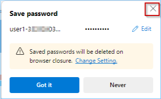

5. If prompted to stay signed in, select **Yes**.


>**Note:** If prompted to take a tour, select **Maybe later**.

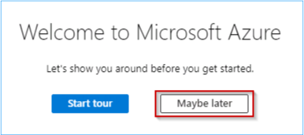

6. Search for **resource group** in the search bar at the top of the page and click on the **Resource groups** option.

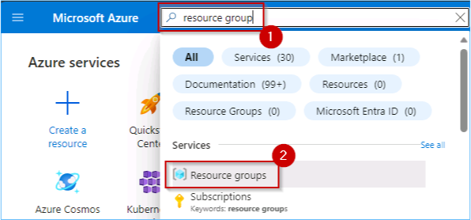

7. Search for **rg-fabric** in the searchbox and click on the **resource group**. 


8. Search for **app service** and select the app service labeled **app-realtime-simulator...**


9. Click on the **Browse** button and a new tab will open.

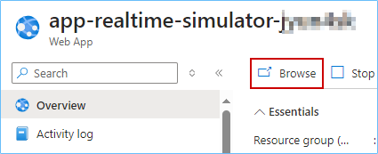

10. **Wait** for the page to load. The following page will appear.


---

### Task 1.1: Use the Data Pipelines/Data Flow ‘No Code-Low Code experience’

In this exercise, you will act as the Data Engineer and transfer Contoso's data from Azure SQL Database into the Lakehouse. 

1. Open **PowerBI** in a new tab by going to [https://app.powerbi.com].

*Click on the **Continue** button.*

   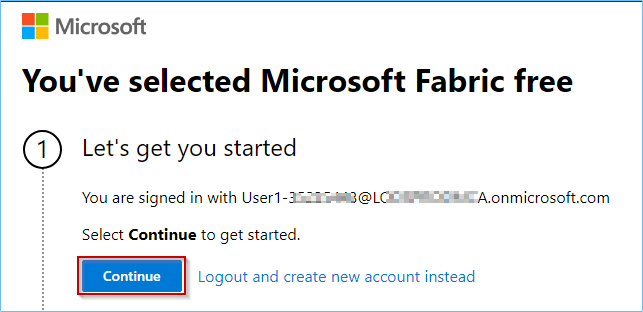

*Type in a 10 digit number in the box.*

   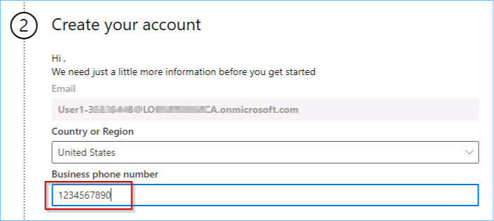

*Click on the **Get Started** button.*

   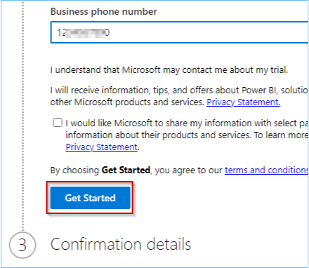

*Again click on the **Get Started** button.*

   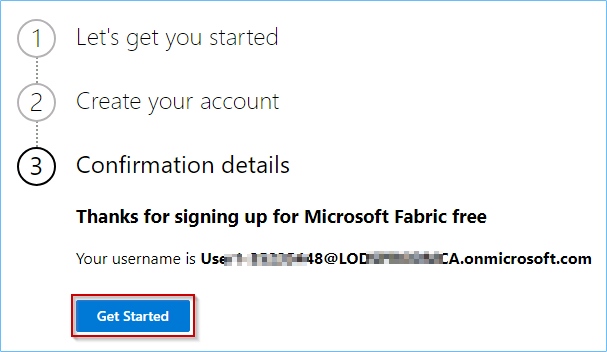

*Wait for the PowerBI Workspace to load*

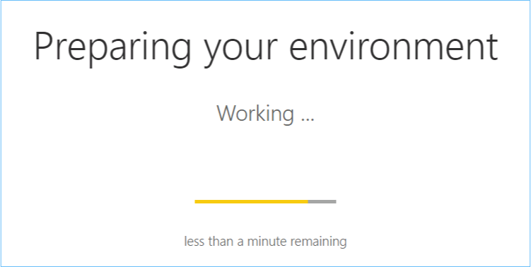

*Close* the top bar for a better view.

   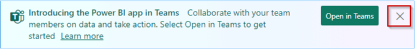

2. In Power BI service, click on **Workspaces**.

3. Click the **+ New workspace** button.

	

4. Type the name **contosoSales**, and append the **6 character suffix** at the end of your resource group and click **Apply**.

>**Note:** Do not include spaces in the workspace name.

   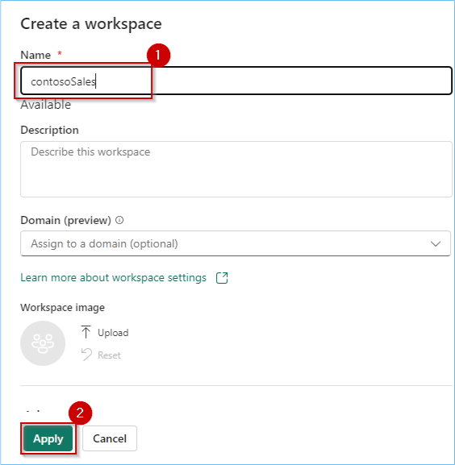

*Click on the **Try free** button.*

   

*Click on the **Got it** button to continue.*

   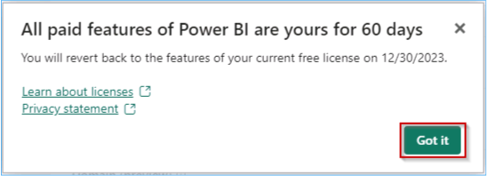

5. Click on **Workspaces** to verify if the workspace with the given name was created, if not perform the steps above again.

**NOTE:** If the workspace you created is not visible, perform **steps 3 to 5** again.

   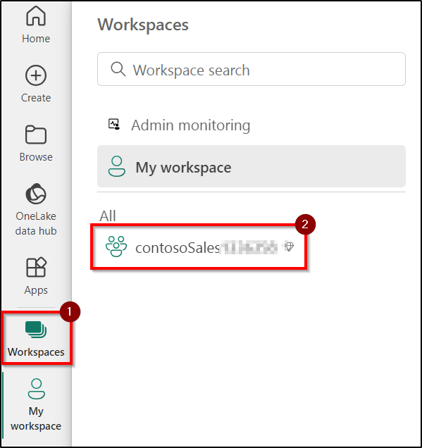

6. In Power BI service, click **+ New** and then select **More options**.

   

7. In the new window, under the Data Engineering section, click on **Lakehouse**.

    

8. **Wait** for the Microsoft Fabric capacity to upgrade and then click on **OK**.

   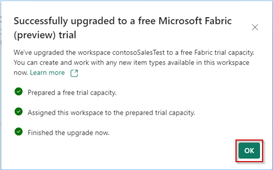

*Wait for the New lakehouse pop-up box to appear*

9. Enter the name **lakehouse**.

10. Click the **Create** button.

    

11. Click on **Workspaces** in the left navigation pane and select **contosoSales...**.

	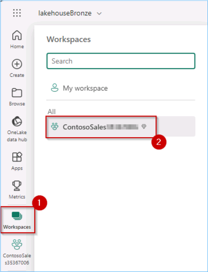


12. Open a new tab on your browser and navigate to Microsoft Fabric at [https://app.fabric.microsoft.com].

13. On the Microsoft Fabric landing page, click on the **Data Factory** experience.


14. Click on **Workspaces** and select the **contosoSales...** workspace.

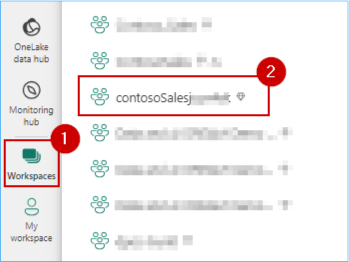

15. Click the **Data Factory** icon in the bottom left corner of the screen to select **Data Factory**.


16. Click on **Data pipeline**.


17. In the pop-up, type the pipeline name **Azure SQL DB Pipeline** and click on the **Create** button.


18. In the Data pipeline window, click on **Copy data assistant**.

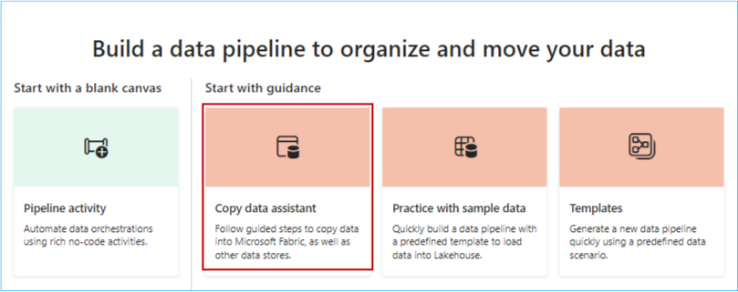

19. In the pop-up, scroll down through the resources, click on **Azure SQL Database** and then click on the **Next** button.

>**Note** You may not see the **Azure SQL Database** in the same location as shown in the screenshot.

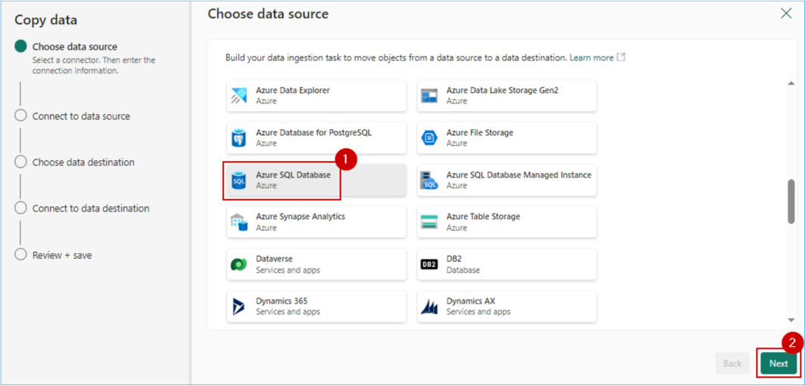

20. Select the **Create new connection** radio button.

>**Note:** To fill in the details for required fileds, we need to fetch the data from the SQL Database resource deployed in the Azure Portal.

*Steps from here are optional. You may move to Task 1.2*


21. Navigate to the **Azure Portal**, in the resource group **rg-fabric...**, search for **sql server** in the resource group window and click on the **mssql...** resource.

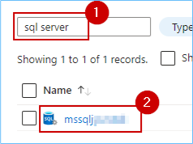

22. Copy the **Server name**.

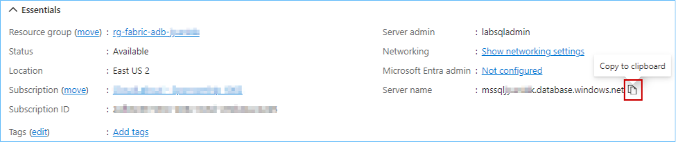

23. Navigate back to the **Fabric** tab on your browser.

<todo  Do we need screenshot here to show Fabric Tab>

24. In the **Server** field, paste the value you copied in step number **11* and type **SalesDb** in the **Database** field.


25. Scroll down and select **Basic** for Authentication kind, enter **labsqladmin** as the Username, **@@##$$** as the Password and click on the **Next** button.


>**Note:** Close any pop-up that you see throughout the lab.
   


>**Note:** Wait for the connection to be created.

26. Click on the **checkbox** for **Select all** and then click on the **Next** button.

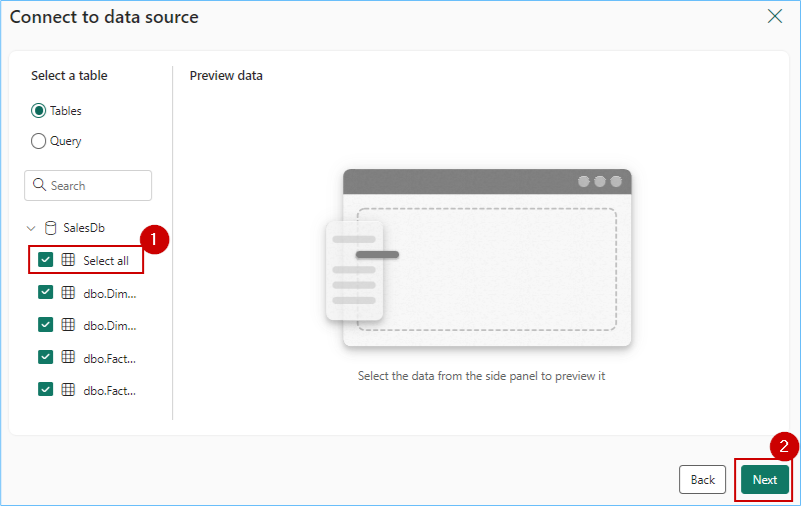

27. Scroll down and click on **Lakehouse**, then click on the **Next** button.


28. Click on the **Existing Lakehouse** radio button, click on the **dropdown**, select **lakehouse...** and then click on the **Next** button.

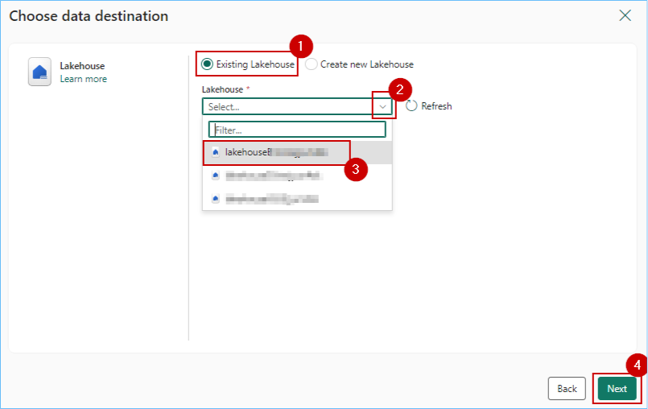

29. Select the **Load to new table** radio button, click on the **checkbox** beside **Source** and then click on **Next**.


30. Click on **Save + Run**.


31. Click on the **OK** button in the Pipeline run window.


>**Note:** Wait for the pipeline to execute.

32. Click on the bell icon at the top right of the screen to verify the **Running status** of the pipeline.


33. Your data has been transfered from Azure SQL Database to Lakehouse.

34. Similarly, you can get data into the Lakehouses using pipelines from various other sources like Snowflake, Dataverse, etc.

---

### Task 1.2: Use ‘New Shortcut’ option from external data sources

Now this is something exciting! This section shows how easy it is to create shortcuts without actually moving data. That is the power of OneLake! In this exercise, you will ingest the curated marketing and product reviews data from ADLS Gen2. 

1. In the contosoSales... workspace, click on **Filter** and select **Lakehouse**.

	

2. Click on the **lakehouse...**.

>**Note:** There are 3 options for lakehouseBronze, namely Lakehouse, Dataset (default) and SQL endpoint. Make sure you select the **Lakehouse** option.


3. Click on the **three dots (Elipse)** on the right side of Files.

4. Click on **New shortcut**.

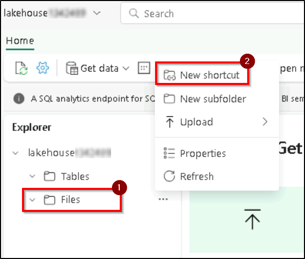

5. In the pop-up window, under **External sources**, select the **Azure Data Lake Storage Gen2** source.


>**Note:** Wait for the screen to load.

6. In the screen below, we need to enter the connection details for the ADLS Gen2 shortcut. For this, we need to get the details from the Storage Account resource.


7. Navigate to the **Azure Portal**, in the **rg-fabric...** resource group search for **storage account** and click on the storage account resource.


8. Expand the **Security + networking** section and click on **Access keys**.


9. Click on the **Show** button under **key1**.


10. Click on the **Copy to clickboard** button.

11. Save this information in a notepad for further use.


12. In the left pane, expand the **Settings** section and click on **Endpoints**.

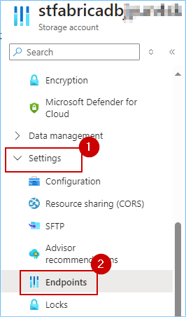

13. Scroll down to copy the **Data Lake Storage** endpoint in the **Data Lake Storage** section.

14. Save the information in a notepad for further use.

>**Note:** You may see different endpoints in addtion to the ones shown in the following screen. Make sure to select **only** the **Data Lake Storage** endpoint.


15. Navigate back to the **Fabric** tab.

16. Paste the endpoint copied in **step 13** under the **URL** field.

17. In the **Authentiation kind** dropdown, select **Account Key**.

18. Paste the **account key** copied in **step number 10**.

19. Click on **Next**.


20. Select the **data** checkbox and click on the **Next** button.

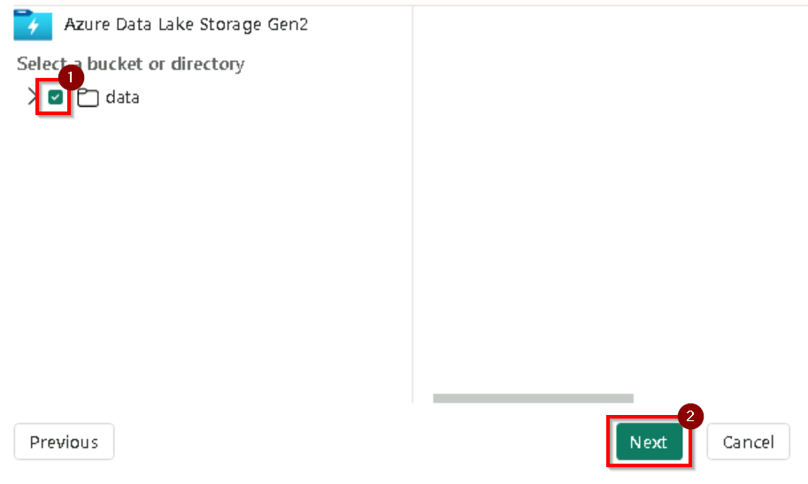

21. Click on the **Create** button.


---

### Task 1.3: Transform data using Dataflow Gen2 ‘No Code-Low Code experience’ Copilot

In this exercise, you will experience how easy it is to use Copilot to transform sales data. 

1. Click on the **Data Factory** icon on the bottom left corner of the screen and select **Data Factory**.


2. Click on **Dataflow Gen2**.


3. Click on the **Get data** button.


4. In the pop-up window, click on the **View more** button.

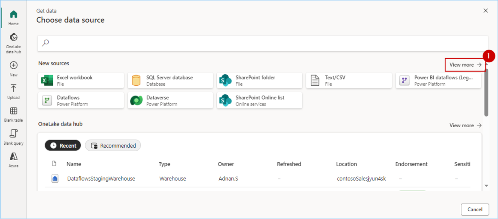

5. Select **Microsoft Fabric** and then click on **Lakehouse**.


6. Click on the **Next** button.


7. Expand **Lakehouse**, **contosoSales...**, **Files** and check the **sales_data.csv** checkbox, then **click** on the **Create** button.

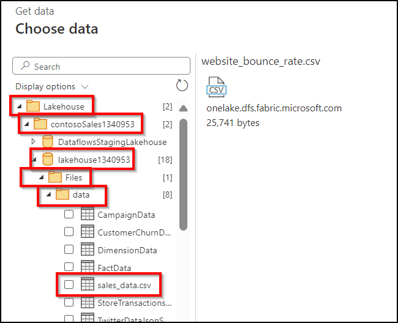

8. Click on the **Copilot** button, paste the **prompt** provided below in the text box and click on the **send** icon.

```
Use first row as header
```


9. Similarly, you can paste the following prompts in Copilot for data transformation.

```
Remove empty rows from GrossRevenue and NetRevenue column
```

>**Note:** Due to time constraints, we will not be publishing and running the Dataflow from the Pipeline.

10. Click on the **close** icon at top right of the **Dataflow** window.


10. Click on **Yes**.


---

### Exercise 2: Unity Catalog (data governance), Metastore experience, RAG and ML

### Task 2.1: Delta Live Table pipeline (Interactive)

1. Navigate to the **Azure Portal**, in the **rg-fabric...** resource group, search for **databricks** and click on the databricks resource with the name **adb-fabric...**.


2. Click on the **Launch Workspace** button.


3.	In the left navigation pane click on **Delta Live Table** 


4. Click on the **Create pipeline** button.


5. Enter the name of the pipeline as **DLT_Pipeline** and click on the file icon to browse the notebook.


6. Click on **Shared**.

7. Click on **Analytics with ADB**.

8. Click on the **01 DLT Notebook**.

9. Click on the **Select** button.


10. Click on the **Create** button.

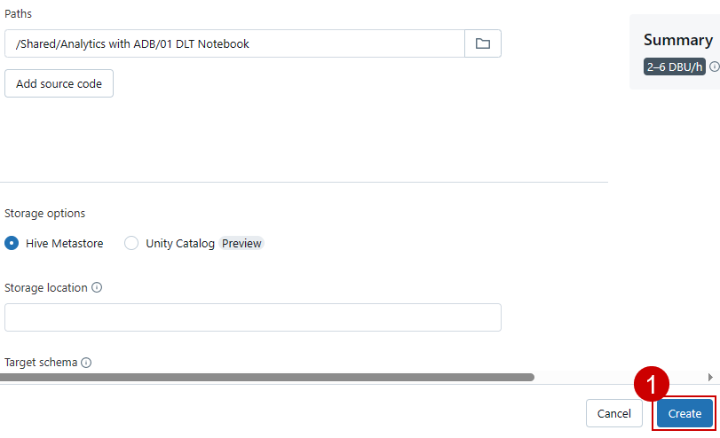

>**Note**: Due to time constraints we have pre-loaded the output tables in your Databricks. We will not be executing this pipeline.

14. The result would look similar to the following screen.


---

### Task 2.2: Explore the data in Azure Databricks environment with Unity Catalog (unified governance solution for data and AI).
	
With the acquisition of Litware Inc., Contoso had a lot of data integration and interoperability challenges. Contoso wanted to make sure that the transition was smooth and data engineers and scientists from Contoso could easily assimilate the data processed by Databricks. Thankfully, they had the help from a slew of Gen AI features right within Azure Databricks to understand and derieve insights from this data. Let's see how!
	
1.	Click on **Catalog**.

2.	Expand **litware_unity_catalog db**.

3.	Expand the **rag** schema.

4.	Click on **silver_customerChurn** table.

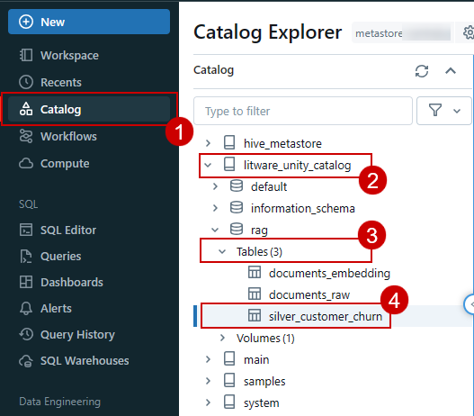

5.	Click on **Accept** in 'AI Suggested Comment' box and Click on **AI Generate**.


	
We can see that Databricks has autogenerated the description for the table and its columns. Users can choose to accept the descriptions or edit them further. This improves the ease of governance on this new data for Contoso. Next, let's see how easy it is to query this data.


	
6.	Select the dropdown on **Create**.

7.	Click on **Query**.


	
8.	Select the **Assistant** tab.

9.	Type following query in the query box: **Retrieve the average total amount of transactions for each store contract. Additionally, calculate the average total amount for customers who have churned and for those who have not churned. Ensure that all average values are rounded to the nearest whole number.**
	

	
By simply using a natural language query, databricks generates an equivalet SQL query.
	
10. Click on the **Arrow** to replace the current code.


11.	**Run** the query.

12.	Check the output.

>**Note:** Make sure Warehouse is in ready mode


Users also have the capability to fix errors in queries with the AI assistant. 
	
13.	In the query, **delete** the last 2/3 letters to introduce an error.

14.	Click on **Run** to see the error.

15.	Click on **Diagnose error** to fix the query issue. 


	
Data discovery is also made simple within Azure Databricks. Users can simply search for table names or the information they are looking for in the global search and all the relevant items are returned.
	
16.	Click on **Search*.

17.	Click on **Open search in a full page**.

18. Search for **campaigns** and press enter.


	
---

### Task 2.3 (OPTIONAL)Deploy LLM Chatbots With the Data Intelligence Platform 

Contoso also wanted to improve their efficientcy with analyzing hundreds of documents about their big merger and their company policies. Azure Databricks provides just the solution with its Delta Lake architecture supporting unstructured data, like PDF documents, with Lang chain models leveraging Databricks Foundation Model for creating custom chatbots. Let's see how this was done.


First, let's ingest our PDFs as a Delta Lake table with path URLs and content in binary format.

1.	Go to **Unity Catalog Volumes**.

2.	Click on **documents_store**.


3.	Click on **pdf_documents**.

4.	Review the Knowledge Base (pdfs).


We'll use Databricks Autoloader to incrementally ingeset new files, making it easy to incrementally consume large volume of files from the data lake in various data formats. Autoloader easily ingests our unstructured PDF data in binary format.

5. Click on **Workspaces**


6. Open the notebook from the path shown in the screenshot below.


This notebook is used to convert the ingested document into delta tables. Lets look at the output tables.

7. Click on **Catalog** and under **rag** database, click on the **documents_raw** table.

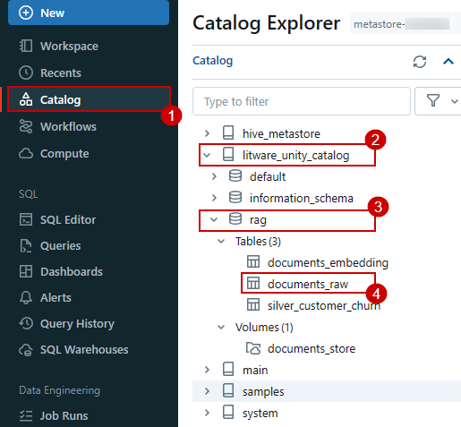

8.	Click on **Sample Data**.

9.	Review the delta table.

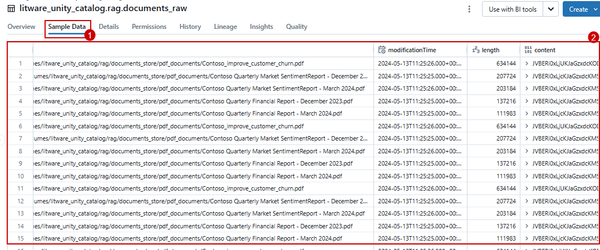

Next we convert the PDF documents bytes to text, extract chunks from their content, and create a vector search index for retreival.

10.	Go to table: **documents_embedding**.

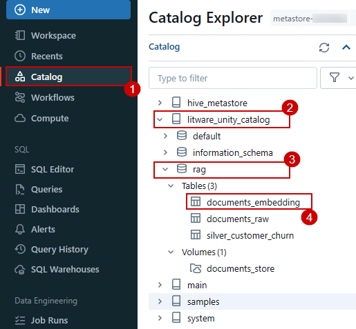

11.	Click **Sample Data**.

12.	Review the Delta Table.

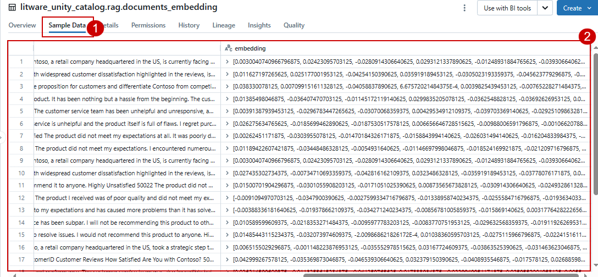

13.	In the upper-right corner, click on the dropdown for **Create**.

14.	Select **Vector search index**. Click on **Cancel** after reviewing the fields.

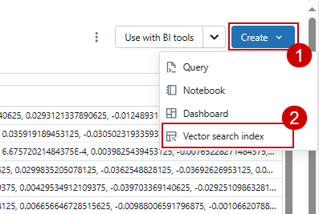

We've just seen how Databricks Lakehouse AI makes it easy to ingest and prepare your documents and deploy a Self-Managed Vector Search index on top of it with just a few lines of code and configuration.

15. Click on **Workspace**.

16. Click on **Shared**.

17. Click on **RetrievalAugmentedGeneration**.


18. Click on notebook **3. Register and Deploy RAG model as Endpoint**.


With this model, we will be able to serve and accept questions based on the documents uploaded.
Everytime we send a question to the chatbot, the following steps occur:
•	The model receiv  es the question
•	The retriever automatically fetches related chunks from our documents
•	A prompt is crafted with the chunks and the question
•	The prompt is sent to the Databricks Foundation Model and Llama 2 serves an accurate answer based on the chunk information!

You will witness this in action [here](https://app-ms-build-2024-demo.azurewebsites.net/#/enterprise-chatbot).

---

### Exercise 3: Power BI Experience
 
### Task 3.1: Create Semantic model and generate insights using Copilot for Power BI

Let us dive deep into the experience of the Business analyst, Wendy. Based on all the gathered data Wendy is expected to create Power BI reports for other data citizens and stakeholders. Let us see the power of Power BI copilot in conjuction with the Direct Lake Mode.

1. Navigate to the Fabric Workspace. 

   

2. In the **contosoSales...** workspace, click on **Filter** and select **Lakehouse**.

   	

3. Click on the **lakehouse...**.

>**Note:** There are 3 options for lakehouseBronze, namely Lakehouse, Dataset (default) and SQL endpoint. Make sure you select the **Lakehouse** option.

   

>**Note:** In case you do not see the 'website_bounce_rate' under the Tables section of the lakehouse, follow the below steps.

   -  Click on **data**.

      

   - Click on the **ellipse**(three icons) in front of **website_bounce_rate.csv**, select **Load to Tables** and then select **New Table**.

      

   - In the pop-up verify the **New table name** and then click on the **Load** button.

      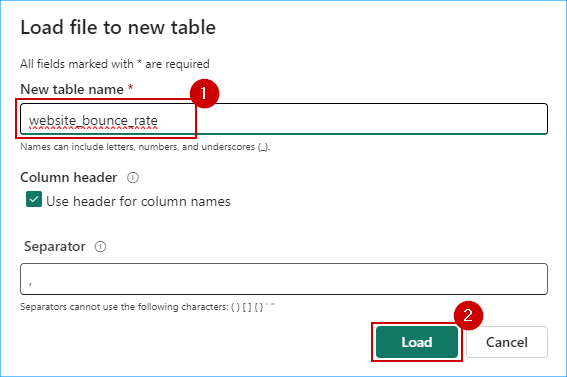


*Once the **website_bounce_rate** delta table is there, we can proceed with the steps ahead*

4. Click on the **New semantic model**. 

   

5. Enter **website_bounce_rate_model** in the Name field. 

6. Select workspace as **contosoSales...** and scroll down.

   

7. Select **website_bounce_rate** table and click on the **Confirm** button. 

   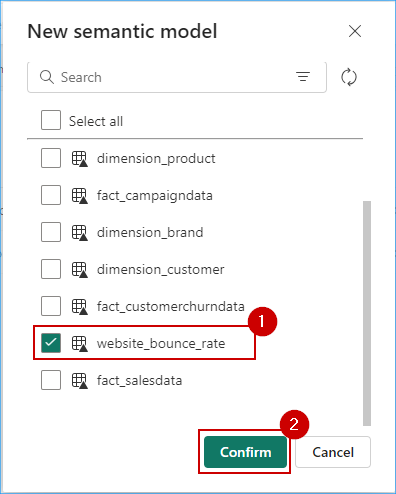

>Wait for the semantic model creation.

8. To create a new report using this semantic model, click on the **New Report** at the top bar.
 
   

9. Click on the **Copilot** icon, collapse all the other three panes and then click on the **Get started** button.

   
	
10. Click on the **Prompt Guide** button.  

11. Select the option **What's in my dataset?**.
   
      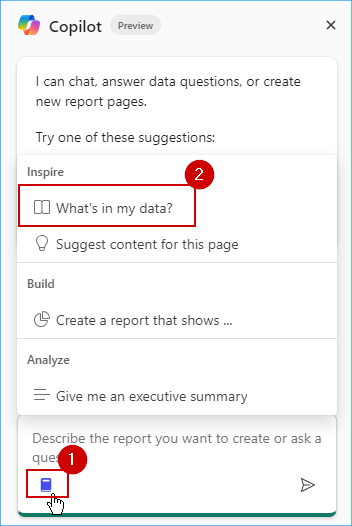

The first option, “What’s in my dataset?’ provides an overview of the contents of the dataset. It identifies and describes what the datasets and attributes are all about and provides a concise detail of the content. The business analyst does not need to wait for someone to explain the dataset to her. This improves the efficiency and volume of report creation for Contoso.

12. Click on the **Prompt Guide** button. 

13. Select the option **Suggest content for this page**. 

      
	
The copilot can not only describe the dataset, but it can also recomment the kind of reports that could be created using this data.

14. Click on the **Customer** related suggested insight as shown in step 1 of the screenshot **Customer Behavior Insights** 

>The Customer insight for you might differ from the screenshot.

15. Click on the **Edit** button as shown in step 2 of the screenshot.  

   

16. Replace the prompt with following: **Create a report Bounce Rate analysis, to show the correlation between customer sentiment, particularly among millennials and Gen Z, unsuccessful product searches across different devices, and the website's bounce rate by customer generations**.  

17. Click on the **Send** button and wait for the results to load. 

      
	
>**Note:** If you see the error message saying, 'Something went wrong.', try refreshing the page and restart the task. Being in a shared environment, the service may be busy at times.

Based on this report, we notice that the website bounce rate for Contoso is especially high amongst the Millenial customer segment. How about we ask Copilot if it has any recommendations for improving this bounce rate.

Let's ask Copilot for suggestions based on the results and data in the report. 

18. Enter the following prompt in Copilot, **Based on the data in the report, what can be done to improve the bounce rate of millennials?** and press **Send** button.
	
      
	
19. Observe the suggestions provided by Copilot. 
	
      
	
20. Expand the **Visualizations** pane and select the **Narratives** visual. 

21. Click on **Copilot (preview)** within the visual.

      
	
22. Select **Give an executive summary**. 

23. Click on **Update** and observe the generated summary. 
 
      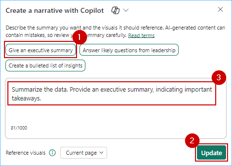
	
The summary could also be generated in another language if specified. The summary is also updated if you filter the report on any particular visual. How cool is that!

---

### Exercise 4: Real-time Analytics experience, explore Streaming data using Copilot for KQL DB

Imagine it is 6 am on the day of Contoso's big Thanksgiving sale. Customers are flocking to their stores in large numbers. We are about to witness the very culmination of Contoso's phonomenal transformation with Microsoft Fabric and ADB. Specifically, we will see how near real-time data is used to make decisions for the next moment in Contoso's stores to ensure optimal temperatures are maintained for their customers while they shop at the big sale! Let's see how! 

### Task 4.1: Ingest real-time/historical data into KQL DB using Eventstream

1. While you are in the Fabric workspace homepage, click on **+ New** and then click on **More options**.

	

2. In the new window, scroll down to the **Real-Time Analytics** section and click on **KQL Database**.

	

3. Enter the name **Contoso-KQL-DB**, click on the **Create** button and wait for the database to be created.

	

4. Click on the **contosoSales** workspace from left navigation pane.

   

5. Click on the **+ New** button.

   

6. Select **Eventstream**.

   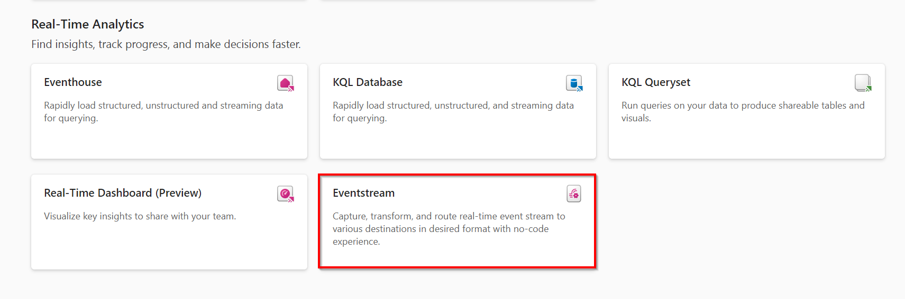

7. Enter the name as **RealtimeDataTo-KQL-DB** and click on **Create** button.

   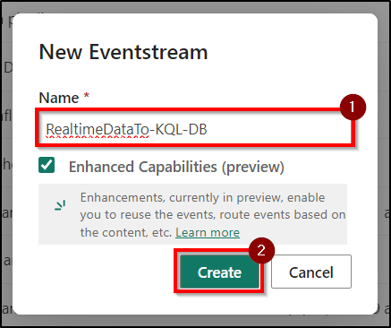

8. Click on the **Add Source** button.

   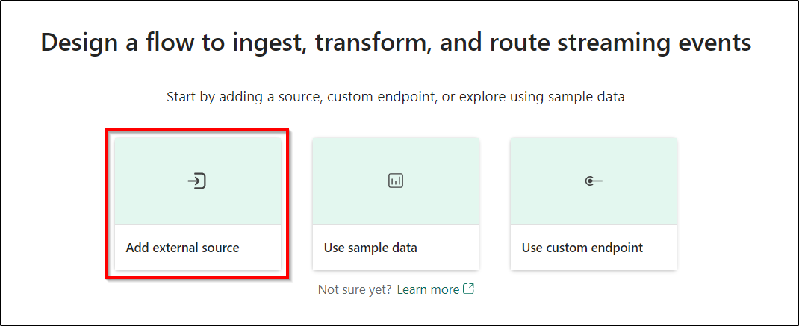

9. Click on the **Azure Event Hub** button.

   

10. To fill in the fields below we need to navigate to Azure Portal.

   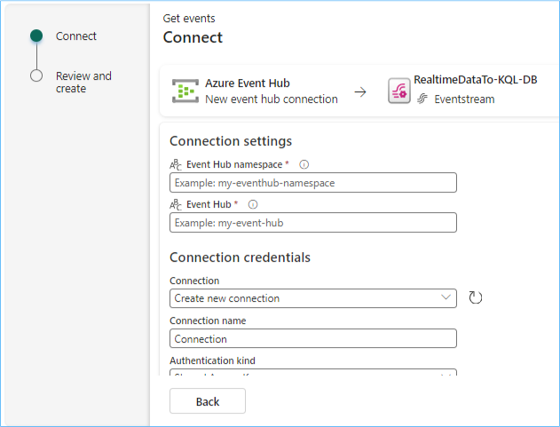

11. Navigate to the **Azure Portal**. In the **rg-fabric...** resource group, search for the **event hubs namespace** and click on the **Event Hubs Namespace** resource.

   

12. Copy the name of the **Event Hub namespace** and paste it in a notepad for further use.

   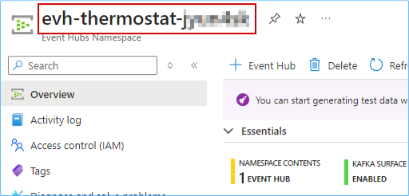

13. In the left navigation pane expand the **Entities** section, click on **Event Hubs**, and then click on the **thermostat** event hub.

   

14. In the left pane expand **Settings**, click on **Shared access policies** and then click on **thermostat**.

   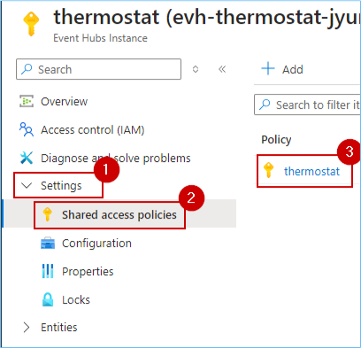

15. Copy the **Primary key** and paste it in a notepad for further use. 

   

16. Go back to the **Fabric tab** on your browser.

17. Make sure you are in the **Create new connection** section, paste the value for **Event Hub namespace** from **step 9** and enter the **Event Hub** value as **thermostat**.

   

18. Scroll down and select **Shared Access Key** for Authentication kind, enter **thermostat** as the Shared Access Key Name and then paste the value copied in **step 12** in the **Shared Access Key**.

19. Select Data format as **JSON** and then click on the **Connect** button.

   

>**Note:** Wait for the connection to be established.

20. Click on the **Next** button.

   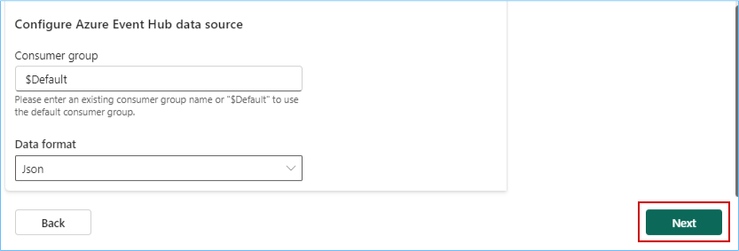

21. Click on the **Add** button.

   

22. In the Eventstream canvas, click on the **New destination** dropdown and select **KQL Database**.

   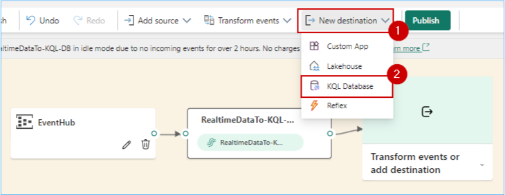

23. Select the **Event processing before ingestion** radio button, enter **RealTimeData** as the Destination name.

24. Select **contosoSales...** and **Contoso-KQL-DB** from the respective 'Workspace' and 'KQL Database' dropdowns.

25. Finally click on the **Create new** button.

   

26. Enter the table name as **thermostat** and then click on the **Done** button.

   

27. Enter the Input data format as **Json**.

   

28. Click on the **Publish** button.

   

Real-time data from the event hub has been ingested successfully into the KQL Database.

---

### Task 4.2: Analyze/discover patterns, identify anomalies and outliers using Copilot

Kusto Query Language is a powerful tool. In this scenario KQL is used to explore Contoso’s data, discover patterns, identify anomalies and outliers, create statistical modeling, and more.

We use KQL to query the thermostat data that’s streaming in near real-time from the devices installed in Contoso’s stores.

1. Click on the **Workspaces** and select **contosoSales...** workspace from left navigation pane.


2. Click on the **+ New** button.
		
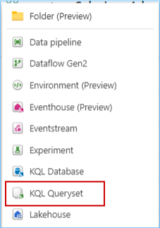

3. Select **KQL Queryset**.


4. Enter **Query Thermostat Data in Near Real-time using KQL Script** as the name and click on the **Create** button.


5. **Wait** for the query set creation and a new screen will display. In this screen, click on **Contoso-KQL-DB**, verify the workspace name and then click on the **Select** button.


6. Select all using **Ctrl + A** and **delete** the pre-written query.


7. Click on the **Copilot** button.


6. **Paste** the query provided below in the query section.

```
What is the average temperature every 1 min?
```

7. Click on the **send** icon.

8. Click on the **Insert** button.


9. Select the **script**, click on the **Run** button and you get the desired result.

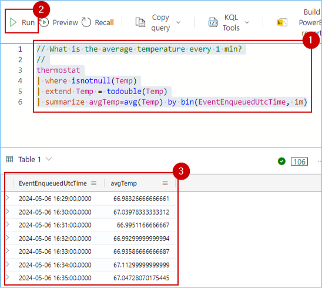

*Similarly you can use the below prompts*

```
Are there any anomalies for this device?
```

---

### Exercise 5: Data Science experience, explore Machine Learning and Business Intelligence scenarios in ADB (read only)
 
So, we saw how Contoso combined historical gold layer data from ADLS Gen2 with all OneLake data via shortcuts. Additionally, we saw how all that data could be easily accessed in Azure Databricks (thanks to the standard delta parquet format). Delta live tables were created in Azure Databricks for further curation of data. Contoso can now leverage the power of machine learning models in ADB on that data to gain meaningful insights and predict customer churn. Let's explore the Data Science Experience in Azure Databricks as Data Scientists!

### Task 5.1: Build ML models, experiments, and log ML model in the built-in model registry using MLflow and batch scoring

The architecture diagram shown here illustrates the end-to-end MLOps pipeline using the Azure Databricks managed MLflow.

After multiple iterations with various hyperparameters, the best performing model is registered in the Databricks MLflow model registry. Then it is set up as the model serving in the Azure Databricks Workspace for low latency requests.
	
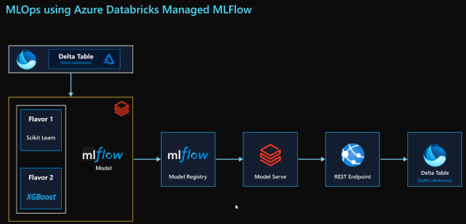

1. Navigate back to the **Databricks workspace** we started for the previous exercise.

2. In the left navigation pane, select **Workspace** and click **Workspace** again. Select **Shared**, click on **Analytics with ADB** and finally click on the **03 ML Solutions in a Box.ipynb** notebook.


Now that we've ingested and processed our customer data, we want to understand what makes one customer more likely to churn than another, so we want to see if we can produce a machine learning model that can accurately predict if a particular customer will churn.

Ultimately, we would like to understand our customers' sentiment so we can create targeted campaigns to improve our sales.

3. Navigate to **cmd 10**.

With the data prepared, we can begin exploring the patterns it contains. 

Let's start by examining the customer churn outcome based on factors like a customer's tenure in months and their total amount spent at Contoso. As a result, we can see a high churn rate is seen if the customer's tenure is low, and they have a lower spend amount.


4. Navigate to **cmd 20**.

5. Navigate to **cmd 21**. 


By registering this model in Model Registry, we can easily reference the model from anywhere within Databricks.    

6. Review the **cmd 29** cell.

Let’s look at the comparison of multiple runs in the UI.

You can visualize the different runs using a parallel coordinates plot, which shows the impact of different parameter values on a metric.

The best ML model for Customer Churn is selected and registered with Databricks model registry.


7. Navigate to **cmd 38**.

For low-latency use cases, you can use MLflow to deploy the model for online serving. The serving system loads the Production model version from the Model Registry. 


8. Navigate to **cmd 40**.

It is then used to predict the probability of Customer Churn using the deployed model and this model endpoint is ready for production.

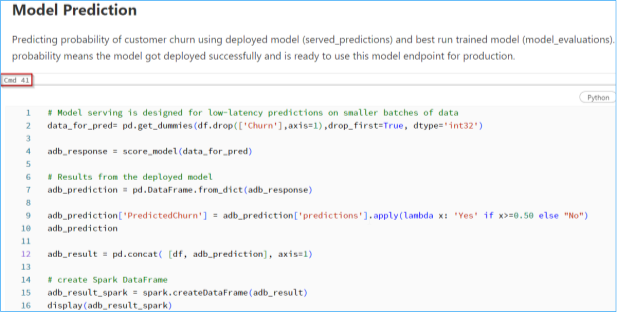

9. Navigate to **cmd 41**. 

Once we have the predicted data, it is stored back in delta tables in the gold layer back in OneLake.

	

---

Congratulations! You as Data Engineers have helped Contoso gain actionable insights from its disparate data sources, thereby contributing to future growth, customer satisfaction, and a competitive advantage.

In this lab we experienced the creation of a simple integrated, open and governed Data Lakehouse foundation using Modern Analytics with Microsoft Fabric and Azure Databricks.

In this lab we covered the following:

First, we explored the Data Engineering experience and learned how to create a Microsoft Fabric enabled workspace, build a Lakehouse, and ingest data into OneLake along with other data engineering operations with dataflow copilot.

Second, we explored an analytics pipeline using open Delta format and Azure Databricks Delta Live Tables to build a simple Lakehouse and integrate with OneLake with shortcuts.

Third, we explored data governance and generative AI features in Azure Databricks with Unity Catalog. We also explored ML and BI scenarios on the Lakehouse. Here we reviewed MLOps pipeline using the Azure Databricks managed MLflow with Azure ML.

Fourth, we the Power BI experience in Fabric with copilot and direct lake mode.

Fifth, we explored Streaming data using KQL DB for a Real-time Analytics experience. Here, we created a KQL Database, ingested real-time and historical data into KQL DB, analyzed patterns to uncover anomalies and outliers with the help of copilot.

Finally, we leveraged Power BI to derive actionable insights from data in the Lakehouse using Direct Lake mode.


