### Exercise 1: Data Engineering experience - Data ingestion from a spectrum of analytical data sources into OneLake

*Before we start executing the steps, we will trigger the simulator app to start streaming data to Eventhub* (**to be used later in exercise 4**).

1. Copy the URL below and paste it in the browser to get the streaming started.
```BASH
   <inject key= "WebAppBrowse" enableCopy="true"/>
```
2. **Wait** for the page to load. The following page will appear.


---

### Task 1.1: Use the Data Pipelines/Data Flow ‘No Code-Low Code experience’

In this exercise, you will act as the Data Engineer and transfer Contoso's data from Azure SQL Database into the Lakehouse. 

Note: *It is expected that the first page has been referred for setting up your **Azure login**.*

1. Open **Power BI** in a new tab using the URL below.

```BASH
https://app.powerbi.com
```
*Close* the top bar for a better view.


2. In Power BI service, click on **Workspaces**.

3. Click the **+ New workspace** button.


4. Copy paste the name of the **Workspace** in the name field and click **Apply**.

```BASH
   <inject key= "WorkspaceName" enableCopy="true"/>
```
   

   Note: *If you see any popup of  **Introducing task flows(Preview)** please click on **Got it**.*


5. Click on **Workspaces** to verify if the workspace with the given name was created, if not perform the steps above again.

   NOTE: *If the workspace you created is not visible, perform **steps 3 to 5** again.*

   

## Create/Build a Lakehouse

Now, let's see how each department can easily create a Lakehouse in the Contoso workspace without any provisioning. They simply provide a name, given the proper access rights of course!

1. Click on the **left bottom icon** and click on **Data Engineering**.

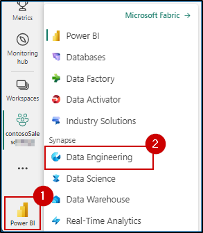

2. In the new window, under the Data Engineering section, click **Lakehouse**.

   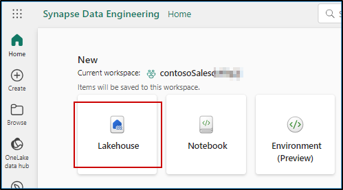

*Wait for the New lakehouse pop-up box to appear*

3. Enter the name **lakehouse**.

```BASH
   <inject key= "lakehouseName" enableCopy="true"/>
```

4. Click the **Create** button.


5. Click on **Workspaces** and select the **contosoSales...** workspace.


6. Click the **Data Factory** icon in the bottom left corner of the screen to select **Data Factory**.


7. Click on **Data pipeline**.


Note: "Wait for the **New pipeline** pop-up box to appear and remove the pre-provided name from the text box.

8. In the New Pipeline pop-up, type the pipeline name **Azure SQL DB Pipeline** and click on the **Create** button.

```BASH
Azure SQL DB Pipeline
```


9. In the Data pipeline window, click on **Copy data assistant**.

Note: *If the **copy data assistant** is not visible in the screen, please scroll up.*


10. Click on **view more** in the **new source** section.

   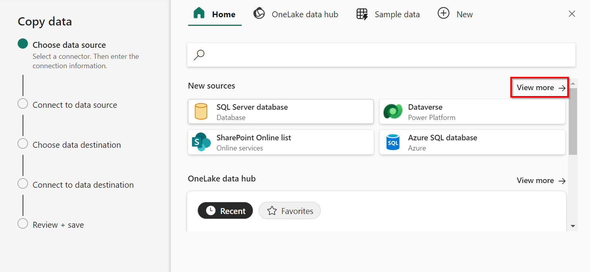

11. We already have 40+ connectors available for the data pipeline from a spectrum of sources in **Microsoft Fabric**.

12. Click on **X** icon in the **upper right corner** of the pop-up. Click on Cancel.
    
Note: *If the close button is not visible, please slide right from the below slider and close the pop up.*

   

13. Click on the 'Yes,Cancel' button.

   

Note: *Due to time constraints, we will not be creating a Data pipeline at this time. You can perform this optional step (found in the appendix) later.*

14. Similarly, you can get data into the Lakehouses using pipelines from a variety of other sources like Snowflake, Dataverse, etc. Your next task is to ingest website bounce rate data from the acquired company Litware Inc.

---

### Task 1.2: Use ‘New Shortcut’ option from external data sources

Now this is something exciting and most powerful! This section shows how easy it is to create shortcuts without actually moving data. That is the power of OneLake! In this exercise, you will ingest the curated bounce rate data for Litware from ADLS Gen2 as an illustration.

1. Click on the workspace icon on the left side bar of the page.


Note: *Click on the collapse icon, as shown in the screenshot below, for better visibility.*


2. In the contosoSales... workspace, click on **Filter** and select **Lakehouse**.

	

3. Click on the **lakehouse...**.

>**Note:** There are 3 options for lakehouse, namely Lakehouse, Dataset (default) and SQL endpoint. Make sure you select the **Lakehouse** option.


4. Click on the **three dots (Elipse)** on the right side of **Files**.
5. Click on **New shortcut**.

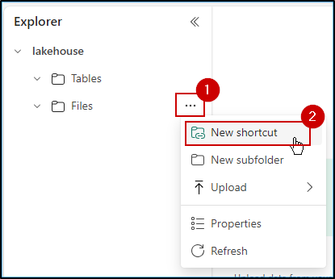

6. In the pop-up window, under **External sources**, select the **Azure Data Lake Storage Gen2** source.


>**Note:** Wait for the screen to load.

7. In the screen below, we need to enter the connection details for the ADLS Gen2 shortcut. For this, we need to get the details from the Storage Account resource.


8. Navigate to the **Azure Portal** search for **resource group** in the search bar at the top of the page and click on the **Resource groups** option.


9. Search for **rg-fabric** in the searchbox and click on the **resource group**. 


10. In the **rg-fabric...** resource group search for **storage account** and click on the storage account resource.


**Note**: Due the the screen size of VM, user will not able to see left navigation bar, please click on the **Hamburger sign** from the above to navigate to the **Security + Networking** and click on the expand button.

11. Expand the **Security + networking** section and click on **Access keys**.


12. Click on the **Show** button under **key1**.


13. Click on the **Copy to clickboard** button.

14. Save this information in a notepad for further use.


15. Navigate back to the **Fabric** tab.

16. Enter the endpoint provided below under the **URL** field.
```BASH
 <inject key= "StorageEndpoint" enableCopy="true"/>
```
17. In the **Authentiation kind** dropdown, select **Account Key**.

18. Paste the **account key** copied in **step number 13**.

19. Click on **Next**.


20. Select the **data** checkbox and click on the **Next** button.


21. Click on the **Create** button.
> Note: *wait for sometime to shortcut get created*


22. And there you go! Your shortcut is now ready! Simply click on the newly created shortcut named data.

23. Click on the newly created shortcut named data.

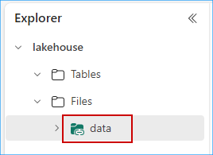

24. Scroll down in the **middle of the screen**, click on the **three dots (Elipse)** on the right side of **website_bounce_rate.csv**.

25. Click on **Load to Tables** and select **New table**.


26. In the pop-up verify the **New table name** and then click on the **Load** button.

Note: *wait for sometime to data to get load into the tables*


27. Expand **Tables** in lakehouse explorer, click on **website_bounce_rate** delta table and view the website bounce rate data.

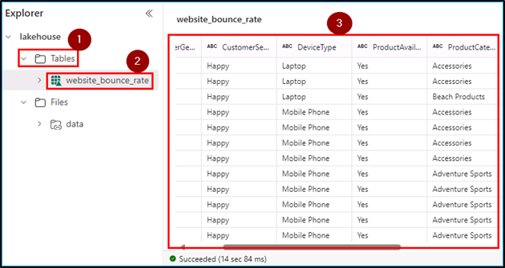

28. You now have a table in **OneLake** with all the website bounce rate information for Contoso to leverage. Next, we proceed with data transformation using Dataflow Gen2 to transform the sales data ingested from Litware.

---

### Task 1.3: Transform data using Dataflow Gen2 using a ‘No Code-Low Code experience’ Copilot

In this exercise, you will experience how easy it is to use Copilot to transform sales data. 

1. Click on the **Data Factory** icon on the bottom left corner of the screen and select **Data Factory**.


2. Click on **Dataflow Gen2**.


3. Click on the **Get data** button.

Note: If you see **New Query** in place of **Get Data**, click on drop down and select **Get Data.**


4. In the pop-up window, click on the **View more** button.


5. Select **Microsoft Fabric** and then click on **Lakehouse**.


6. Click on the **Next** button.

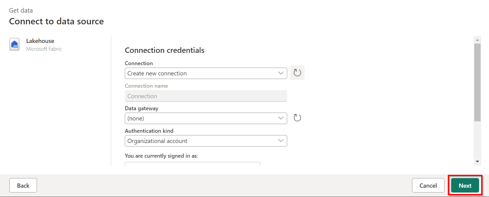

7. Expand **Lakehouse** > **contosoSales...** > **Lakehouse...** > **Files** > **data** and check the **sales_data.csv** checkbox, then **click** on the **Create** button.

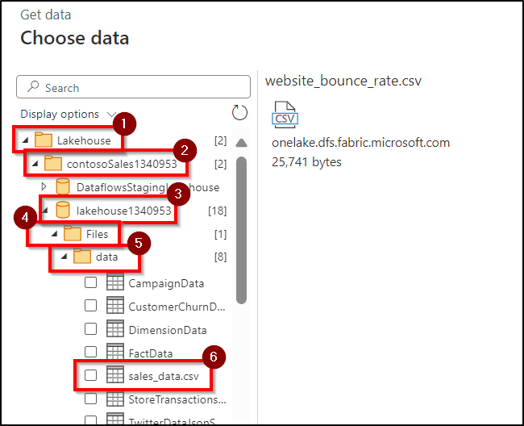

8. **Click** on **create** button from the bottom.

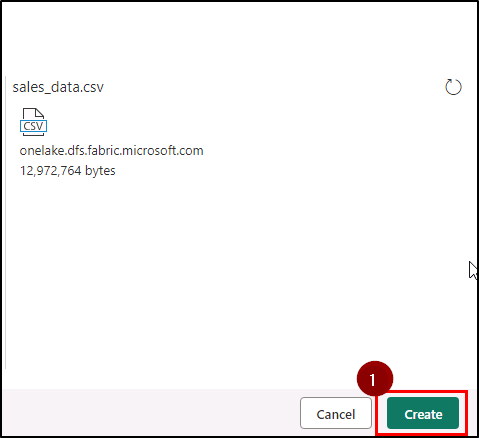

9. Collapse the **Queries** pane and take a look at the sales dataset (**note that the first row of this dataset is not a header**).

    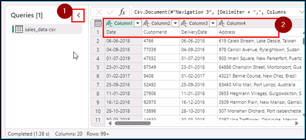

**Let's use Copilot to perform data cleansing.**

8. Click on the **Copilot** button, paste the **prompt** provided below in the text box and click on the **send** icon.

   Note: If user is not able to see copilot, click on the right arrow as shown below.

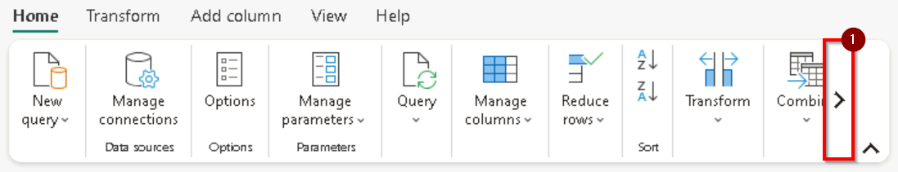

```BASH
 In the table sales_data csv, apply first row as headers.
```

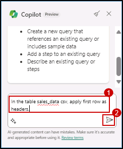

9. Scroll to the right hand side and observe the **GrossRevenue** and **NetRevenue** columns (**there are some empty rows with null values**).

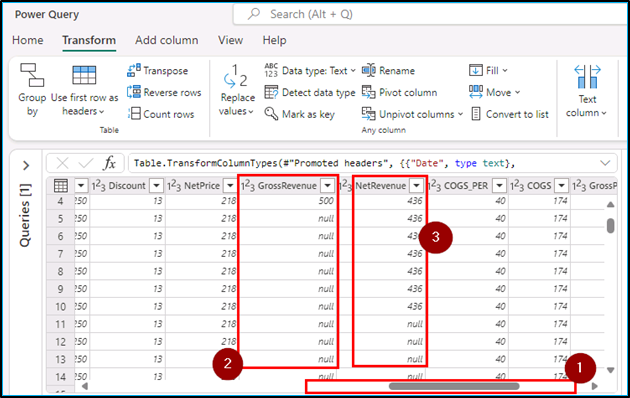

**Let's use Copilot to remove empty rows.**

10. Similarly, paste the prompt below in Copilot and click on the send icon.
    
```BASH
In the table sales_data csv, remove empty rows from GrossRevenue and NetRevenue columns.
```

>**Note:** Due to time constraints, we will not be publishing and running the Dataflow from the Pipeline.

10. Click on the **close** icon at top right of the **Dataflow** window.
    
Note: *If required please reduce the browser page size or scroll up to close the dataflow window.*


10. Click on **Yes**.


Congrats for completing this data transformation! Now, as you know, Litware was primarily using Azure Databricks with their data stored in ADLS Gen2 before the acquisition. Post merger, as one unified company – Contoso, they decided to leverage Azure Databricks to build and manage reliable data pipelines via Delta Live Tables (DLT). Now, you will see the amazing power of Unity Catalog that Contoso’s data architects used to quickly learn all about Litware's data without having to go through tons of documents. And all by simply leveraging AI and data intelligence.

---
