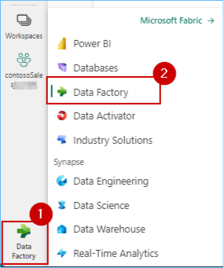
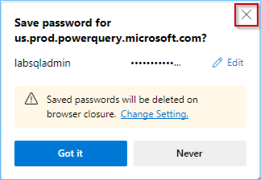
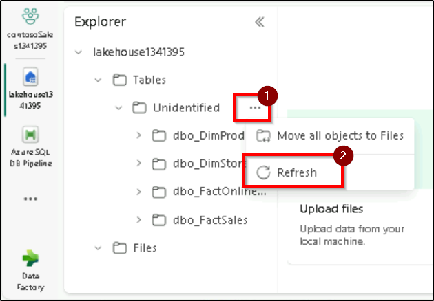
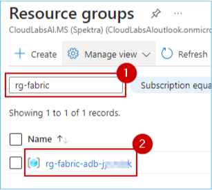
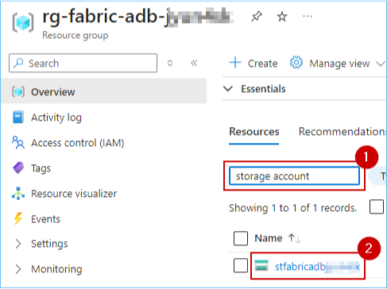

### Exercise 1: Data Engineering experience - Data ingestion from a spectrum of analytical data sources into OneLake

*Before we start executing the steps, we will trigger the simulator app to start streaming data to eventhub.*

1. Copy the below URL and paste it in the browser to get the streaming started.
```BASH
   <inject key= "WebAppBrowse" enableCopy="true"/>
```
2. **Wait** for the page to load. The following page will appear.


---

### Task 1.1: Use the Data Pipelines/Data Flow ‘No Code-Low Code experience’

In this exercise, you will act as the Data Engineer and transfer Contoso's data from Azure SQL Database into the Lakehouse. 

1. Open **PowerBI** in a new tab by going to 

```BASH
https://app.powerbi.com
```

*Close* the top bar for a better view.

   

2. In Power BI service, click on **Workspaces**.

3. Click the **+ New workspace** button.

	

4. Copy paste the name of the **Workspace** in the name field and click **Apply**.

```BASH
   <inject key= "WorkspaceName" enableCopy="true"/>
```
   


5. Click on **Workspaces** to verify if the workspace with the given name was created, if not perform the steps above again.

**NOTE:** If the workspace you created is not visible, perform **steps 3 to 5** again.

   

6. In Power BI service, click **+ New** and then select **More options**.

   

7. In the new window, under the Data Engineering section, click on **Lakehouse**.

    

*Wait for the New lakehouse pop-up box to appear*

9. Enter the name **lakehouse**.

```BASH
   <inject key= "lakehouseName" enableCopy="true"/>
```

10. Click the **Create** button.

    

11. Open a new tab on your browser and navigate to Microsoft Fabric at 
```BASH
https://app.fabric.microsoft.com
```
**Note**: If you are seeing "Enter your email, we'll check if you need to create a new account" please provide the email ID you provided to signin into Azure.

```BASH
<inject key= "AzureAdUserEmail" enableCopy="true"/>
```

12. On the Microsoft Fabric landing page, click on the **Data Factory** experience.


13. Click on **Workspaces** and select the **contosoSales...** workspace.


14. Click the **Data Factory** icon in the bottom left corner of the screen to select **Data Factory**.



15. Click on **Data pipeline**.


*Wait for the New pipeline pop-up box to appear*

16. In the pop-up, type the pipeline name **Azure SQL DB Pipeline** and click on the **Create** button.

```BASH
Azure SQL DB Pipeline
```


17. In the Data pipeline window, click on **Copy data assistant**.


18. In the pop-up, scroll down through the resources, click on **Azure SQL Database** and then click on the **Next** button.

>**Note** You may not see the **Azure SQL Database** in the same location as shown in the screenshot.


19. Select the **Create new connection** radio button.

>**Note:** To fill in the details for required fields, we need to fetch the data from the SQL Database resource deployed in the Azure Portal, due to the time constrain we have provided the details below.


20. In the **Server** field, paste the value from the below.
```BASH
 <inject key= "MssqlServer" enableCopy="true"/>
```

21. Enter **SalesDb** in the **Database** field.

```BASH
SalesDb
```


22. Scroll down and select **Basic** for Authentication kind, enter **labsqladmin** as the Username, **Smoothie@2024** as the Password and click on the **Next** button.

```BASH
labsqladmin
```
```BASH
Smoothie@2024
```


>**Note:** Close any pop-up that you see throughout the lab.
   



23. Click on the **checkbox** for **Select all** and then click on the **Next** button.


Note: *Wait for the source to be appeared.*

27. Scroll down and click on **Lakehouse**, then click on the **Next** button.


28. Click on the **Existing Lakehouse** radio button, click on the **dropdown**, select **lakehouse...** and then click on the **Next** button.


Note: *Wait for the source to be appeared.*

29. Select the **Load to new table** radio button, click on the **checkbox** beside **Source** and then click on **Next**.


30. Click on **Save + Run**.


31. Click on the **OK** button in the Pipeline run window.


>**Note:** Wait for the pipeline to execute.

32. Click on the bell icon at the top right of the screen to verify the **Running status** of the pipeline.


33. Your data has been transfered from Azure SQL Database to Lakehouse.

34. Similarly, you can get data into the Lakehouses using pipelines from various other sources like Snowflake, Dataverse, etc.

---

### Task 1.2: Use ‘New Shortcut’ option from external data sources

Now this is something exciting! This section shows how easy it is to create shortcuts without actually moving data. That is the power of OneLake! In this exercise, you will ingest the curated marketing and product reviews data from ADLS Gen2. 

1. In the contosoSales... workspace, click on **Filter** and select **Lakehouse**.

	

2. Click on the **lakehouse...**.

>**Note:** There are 3 options for lakehouse, namely Lakehouse, Dataset (default) and SQL endpoint. Make sure you select the **Lakehouse** option.


>**Note:** When you enter into the lakehouse, if you are seeing the folder called undefined under tables refresh by clicking on the **three dot (Elipse)** 



3. Click on the **three dots (Elipse)** on the right side of Files.

4. Click on **New shortcut**.


5. In the pop-up window, under **External sources**, select the **Azure Data Lake Storage Gen2** source.


>**Note:** Wait for the screen to load.

6. In the screen below, we need to enter the connection details for the ADLS Gen2 shortcut. For this, we need to get the details from the Storage Account resource.


7. Navigate to the **Azure Portal** search for **resource group** in the search bar at the top of the page and click on the **Resource groups** option.


7. Search for **rg-fabric** in the searchbox and click on the **resource group**. 



7. In the **rg-fabric...** resource group search for **storage account** and click on the storage account resource.



**Note**: Due the the screen size of VM, user will not able to see left navigation bar, please click on the "Hamburger sign* from the above to navigate to the **Security + Networking** and click on the expand button.

8. Expand the **Security + networking** section and click on **Access keys**.


9. Click on the **Show** button under **key1**.


10. Click on the **Copy to clickboard** button.

11. Save this information in a notepad for further use.


15. Navigate back to the **Fabric** tab.

16. Enter the endpoint provided below under the **URL** field.
```BASH
 <inject key= "StorageEndpoint" enableCopy="true"/>
```
17. In the **Authentiation kind** dropdown, select **Account Key**.

18. Paste the **account key** copied in **step number 10**.

19. Click on **Next**.


20. Select the **data** checkbox and click on the **Next** button.


21. Click on the **Create** button.


22. Click on the newly created shortcut named data.


23. Scroll down in the **middle of the screen**, click on the **three dots (Elipse)** on the right side of **website_bounce_rate.csv**.

24. Click on **Load to Tables** and select **New table**.


25. In the pop-up verify the **New table name** and then click on the **Load** button.


---

### Task 1.3: Transform data using Dataflow Gen2 ‘No Code-Low Code experience’ Copilot

In this exercise, you will experience how easy it is to use Copilot to transform sales data. 

1. Click on the **Data Factory** icon on the bottom left corner of the screen and select **Data Factory**.


2. Click on **Dataflow Gen2**.


3. Click on the **Get data** button.


4. In the pop-up window, click on the **View more** button.


5. Select **Microsoft Fabric** and then click on **Lakehouse**.


**Note**: User might see a popup page of datasource to select, and might not able to see any option, please click on next to continue with the lakehouse connection.

6. Click on the **Next** button.


7. Expand **Lakehouse** > **contosoSales...** > **Lakehouse...** > **Files** > **data** and check the **sales_data.csv** checkbox, then **click** on the **Create** button.


8. Click on the **Copilot** button, paste the **prompt** provided below in the text box and click on the **send** icon.

```BASH
Use first row as header in sales_data table
```


9. Similarly, you can paste the following prompts in Copilot for data transformation.

```BASH
Remove empty rows from GrossRevenue and NetRevenue column from sales_data table
```

>**Note:** Due to time constraints, we will not be publishing and running the Dataflow from the Pipeline.

10. Click on the **close** icon at top right of the **Dataflow** window.


10. Click on **Yes**.


---
