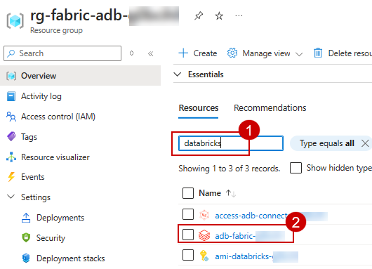
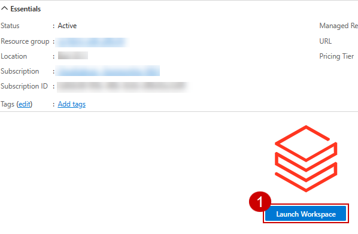
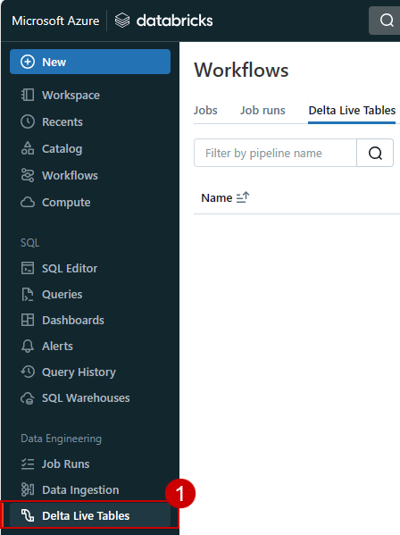
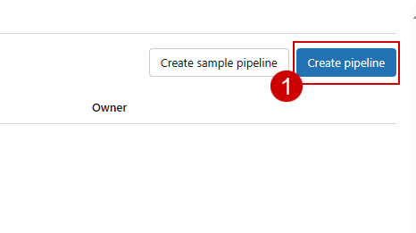
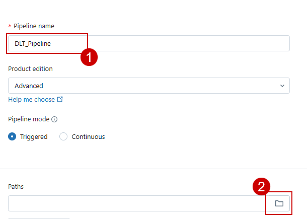
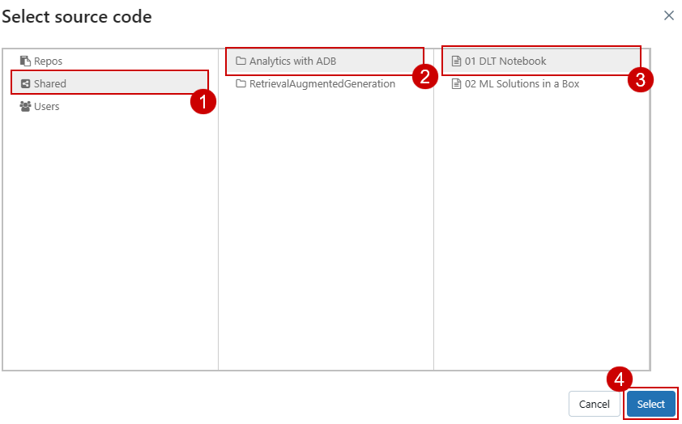
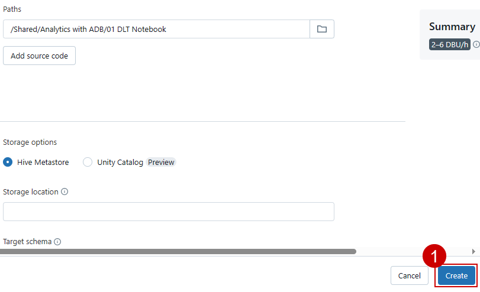

### Exercise 2: DLT Pipelines-Unity Catalog for Data governance, Metastore experience Retrieval Augmented Generation and Machine Learning

### Task 2.1: Explore Delta Live Table pipeline (Data Transformation)

Delta Live Tables (DLT) allow you to build and manage reliable data pipelines that deliver high-quality data in Lakehouse. DLT helps data engineering teams simplify ETL development and management with declarative pipeline development, automatic data testing, and deep visibility for monitoring and recovery.

1. Navigate to the **Azure Portal**, in the **rg-fabric-adb** resource group, search for **databricks** and click on the databricks resource with the name **adb-fabric...**.



2. Click on the **Launch Workspace** button.



3.Scroll down in the left navigation pane and click on **Delta Live Table.** 



4. Click on the **Create pipeline** button.



5. Enter the name of the pipeline as **DLT_Pipeline** and click on the file icon to browse the notebook.

```BASH
DLT_Pipeline
```


6. Click on **Shared**.

7. Click on **Analytics with ADB**.

8. Click on the **01 DLT Notebook**.

9. Click on the **Select** button.



10. Click on the **Create** button.



>**Note**: Do not click on the Start button. Due to time constraints we have pre-loaded the output tables in your Databricks. We will not be executing this pipeline.

14. If you were clicked on the Start button, you would have seen a result similar to the one in the following screenshot. Click on the screenshot for a better view.


---

### Task 2.2: Explore the data in Azure Databricks environment with Unity Catalog (unified governance solution for data and AI).
	
We saw how Contoso utilized DLT pipelines to create a medallion architecture on their data. Now let’s look at how data governance was managed on this curated data across the organization and made easy with Unity Catalog.

With the acquisition of Litware Inc., Contoso had a lot of data integration and interoperability challenges. They wanted to make sure that the transition was smooth, and their data engineers and data scientists could easily assimilate the data processed by Databricks. Thankfully, they were able to leverage Gen AI features right within Azure Databricks to understand and derive insights from this data.

**Note**: Due to time constraints, the following steps will be completed via an online Click-by-Click. Please follow the green beacons for this exercise.

- This exercise will be performed outside the VM browser.
- Please return back to the VM browser once you see the End of Task 2.2 screen.
- Once you press the Agree button, press the A key on your keyboard if you do not see the annotations.

1. Click on the **[hyperlink](https://regale.cloud/Microsoft/viewer/3066/task-22-explore-the-data-in-azure-databricks-environment-with-unity-catalog/index.html#/0/1)**

2. Continue with next excercise.

