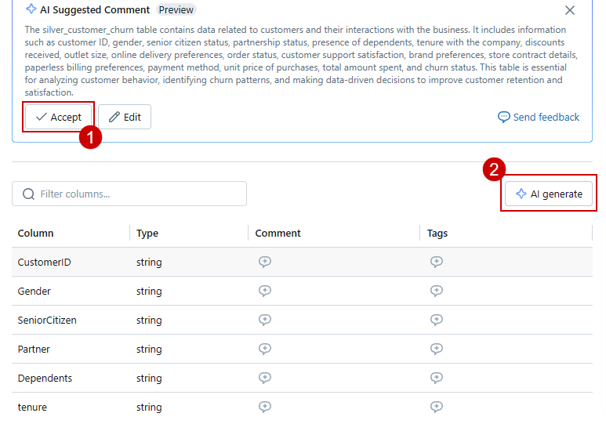

### Exercise 2: Unity Catalog (data governance), Metastore experience, RAG and ML

### Task 2.1: Delta Live Table pipeline (Interactive)

1. Navigate to the **Azure Portal**, in the **rg-fabric-adb** resource group, search for **databricks** and click on the databricks resource with the name **adb-fabric...**.


2. Click on the **Launch Workspace** button.


3.	In the left navigation pane click on **Delta Live Table** 


4. Click on the **Create pipeline** button.


5. Enter the name of the pipeline as **DLT_Pipeline** and click on the file icon to browse the notebook.

```BASH
DLT_Pipeline
```


6. Click on **Shared**.

7. Click on **Analytics with ADB**.

8. Click on the **01 DLT Notebook**.

9. Click on the **Select** button.


10. Click on the **Create** button.


>**Note**: Due to time constraints we have pre-loaded the output tables in your Databricks. We will not be executing this pipeline.

14. The result would look similar to the following screen.


---

### Task 2.2: Explore the data in Azure Databricks environment with Unity Catalog (unified governance solution for data and AI). -- click-by-click.
	
We saw how Contoso was able to utilize DLT pipelines to create a medallion architecture on their data. Now let us take a look at how data governance was managed on this curated data across the organization and how it was made easy with Unity catalog.

With the acquisition of Litware Inc., Contoso had a lot of data integration and interoperability challenges. Contoso wanted to make sure that the transition was smooth and data engineers and scientists from Contoso could easily assimilate the data processed by Databricks. Thankfully, they had the help from Gen AI features right within Azure Databricks to understand and derive insights from this data. Let's see how!

**Note**: Following steps will be executed Click-by-click due to time considerations for setting up the unity catalog. Please follow the green beacons for this exercise.
	
1.	Click on **Catalog**.

2.	Expand **litware_unity_catalog db**.

3.	Expand the **rag** schema.

4.	Click on **silver_customerChurn** table.


5.	Click on **Accept** in 'AI Suggested Comment' box and Click on **AI Generate**.


	
We can see that Databricks has autogenerated the description for the table and its columns. Users can choose to accept the descriptions or edit them further. This improves the ease of governance on this new data for Contoso. Next, let's see how easy it is to query this data.


	
6.	Select the dropdown on **Create**.

7.	Click on **Query**.


	
8.	Select the **Assistant** tab.

9.	Type following query in the query box: **Retrieve the average total amount of transactions for each store contract. Additionally, calculate the average total amount for customers who have churned and for those who have not churned. Ensure that all average values are rounded to the nearest whole number.**
	

	
By simply using a natural language query, databricks generates an equivalet SQL query.
	
10. Click on the **Arrow** to replace the current code.


11.	**Run** the query.

12.	Check the output.

>**Note:** Make sure Warehouse is in ready mode


Users also have the capability to fix errors in queries with the AI assistant. 
	
13.	In the query, **delete** the last 2/3 letters to introduce an error.

14.	Click on **Run** to see the error.

15.	Click on **Diagnose error** to fix the query issue. 


	
Data discovery is also made simple within Azure Databricks. Users can simply search for table names or the information they are looking for in the global search and all the relevant items are returned.
	
16.	Click on **Search*.

17.	Click on **Open search in a full page**.

18. Search for **campaigns** and press enter.


	
---

### Task 2.3 (OPTIONAL)Deploy LLM Chatbots With the Data Intelligence Platform 

Contoso also wanted to improve their efficientcy with analyzing hundreds of documents about their big merger and their company policies. Azure Databricks provides just the solution with its Delta Lake architecture supporting unstructured data, like PDF documents, with Lang chain models leveraging Databricks Foundation Model for creating custom chatbots. Let's see how this was done.

**Note**: Following steps will be executed Click-by-click due to time considerations for setting up the unity catalog. Please follow the green beacons for this exercise.

```BASH
https://regale.cloud/Microsoft/viewer/3067/task-23-deploy-llm-chatbots-with-the-data-intelligence-platform/index.html#/0/0
```
