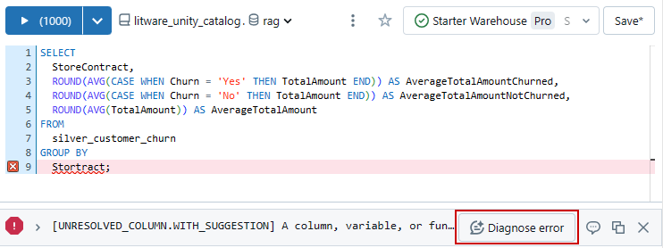
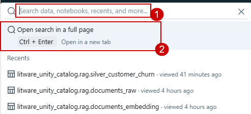

### Exercise 2: DLT Pipelines-Unity Catalog for Data governance, Metastore experience Retrieval Augmented Generation and Machine Learning

### Task 2.1: Explore Delta Live Table pipeline (Data Transformation)

Delta Live Tables (DLT) allow you to build and manage reliable data pipelines that deliver high-quality data in Lakehouse. DLT helps data engineering teams simplify ETL development and management with declarative pipeline development, automatic data testing, and deep visibility for monitoring and recovery.

1. Navigate to the **Azure Portal**, in the **rg-fabric-adb** resource group, search for **databricks** and click on the databricks resource with the name **adb-fabric...**.


2. Click on the **Launch Workspace** button.


3.Scroll down in the left navigation pane and click on **Delta Live Table.** 


4. Click on the **Create pipeline** button.


5. Enter the name of the pipeline as **DLT_Pipeline** and click on the file icon to browse the notebook.

```BASH
DLT_Pipeline
```


6. Click on **Shared**.

7. Click on **Analytics with ADB**.

8. Click on the **01 DLT Notebook**.

9. Click on the **Select** button.


10. Click on the **Create** button.


>**Note**: Do not click on the Start button. Due to time constraints we have pre-loaded the output tables in your Databricks. We will not be executing this pipeline.

14. Had you clicked on the Start button, you would have seen the result similar to the following screenshot.


---

### Task 2.2: Explore the data in Azure Databricks environment with Unity Catalog (unified governance solution for data and AI).
	
We saw how Contoso was able to utilize DLT pipelines to create a medallion architecture on their data. Now let’s look at how data governance was managed on this curated data across the organization and how it was made easy with Unity Catalog.

With the acquisition of Litware Inc., Contoso had a lot of data integration and interoperability challenges. Contoso wanted to make sure that the transition was smooth and their data engineers and data scientists could easily assimilate the data processed by Databricks. Thankfully, they had the help from a wide selection of Gen AI features right within Azure Databricks to understand and derive insights from this data. Let's see how!

**Note**: Due to time constraints, the following steps will be completed via an online Click-by-Click. Please follow the green beacons for this exercise.

1. Open the below link of click-by-click in a new tab of VM Browser.

```BASH
https://regale.cloud/Microsoft/viewer/3066/task-22-explore-the-data-in-azure-databricks-environment-with-unity-catalog/index.html#/0/0
```
2. Click on the Start Demo button.


3. 	Follow the green beacons and expand **litware_unity_catalog db**.
4.	Expand the **rag** schema and followed by **tables**.
5.	Click on **silver_customer_churn** table.


5.	Click on **Accept** in 'AI Suggested Comment' box and Click on **AI Generate**.


	
We can see that AI in Azure Databricks has autogenerated the description for the table and its columns. Users can choose to accept the descriptions or edit them further. This improves the ease of governance on this new data for Contoso. There’s no need for Contoso’s data engineers to read through tons of documents to learn about Litware's data. How cool is that? Next, let's see how easy it is to query this data.


	
6.	Select the dropdown on **Create**.

7.	Click on **Query**.


	
8.	Select the **Assistant** tab.

9. Click on the query area and click on the **send** button.
	

	
By simply using a natural language query and leveraging the AI generated table and field descriptions mentioned earlier, Azure Databricks generates an equivalent SQL query. There’s no need to be skilled in SQL queries and so business friendly, right?
	
10. Click on the **Arrow** to replace the current code.


11.	**Run** the query.

12.	Check the output.


Users also have the capability to fix errors in queries with the AI assistant. Let's intentionally introduce an error by misspelling a table name and see the AI's response.

13.	In the query, **delete** the last 2/3 letters to introduce an error.

14.	Click on **Run** to see the error.

15.	Click on Diagnose error to fix the query issue. See how easily the error is fixed! It is like having a virtual assistant available 24 hours!



14. Click on the **Arrow** to replace the current code.


	
Data discovery is also made simple within Azure Databricks. Users can simply search for table names or the information they are looking for in the global search and all the relevant items are returned, again leveraging the table and field descriptions created by AI and data intelligence mentioned earlier.

16.	Click on **Search*.

17.	Click on **Open search in a full page**.



Click on the search box to search for Find information about customers who have churned with paperless billing and short tenure. and then click on show all results. Now, the next big challenge for Contoso was to get visibility of their Market Sentiment KPI. Remember, the Market Sentiment before the acquisition was at an all-time low. News articles and analyst reviews were being continuously published. All this unstructured data had to be efficiently assimilated so that the Market Sentiment could be tracked. That brings us to the next task. Let us see!

18. Click on the search box to search for **Find information about customers who have churned with paperless billing and short tenure.** and then click on show all results. Now, the next big challenge for Contoso was to get visibility of their Market Sentiment KPI. Remember, the Market Sentiment before the acquisition was at an all-time low. News articles and analyst reviews were being continuously published. All this unstructured data had to be efficiently assimilated so that the Market Sentiment could be tracked. That brings us to the next task.


---


