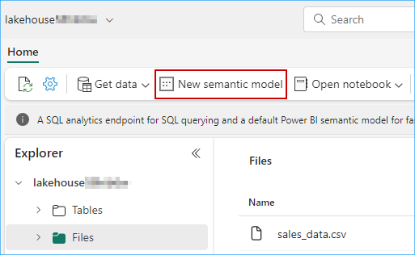

### Exercise 3: Power BI Experience
 
### Task 3.1: Create Semantic model and generate insights using Copilot for Power BI

Let us dive deep into the experience of the Business analyst, Wendy. Based on all the gathered data Wendy is expected to create Power BI reports for other data citizens and stakeholders. Let us see the power of Power BI copilot in conjuction with the Direct Lake Mode.

1. Navigate to the Fabric Workspace. 

   

2. In the **contosoSales...** workspace, click on **Filter** and select **Lakehouse**.

   	

3. Click on the **lakehouse...**.

>**Note:** There are 3 options for lakehouse, namely Lakehouse, Dataset (default) and SQL endpoint. Make sure you select the type **Lakehouse** option.

   

>**Note:** In case you do not see the 'website_bounce_rate' under the Tables section of the lakehouse, follow the below steps. If you are able to see it, please continue with step 4.

a. Click on **data**.


b. Click on the **ellipse**(three icons) in front of **website_bounce_rate.csv**, select **Load to Tables** and then select **New Table**.


c. In the pop-up verify the **New table name** and then click on the **Load** button.


*Once the **website_bounce_rate** delta table is there, we can proceed with the steps ahead*

4. Click on the **New semantic model**. 

   

5. Enter **website_bounce_rate_model** in the Name field.

```BASH
website_bounce_rate_model
```

7. Select workspace as **contosoSales...** and scroll down.

   

8. Select **website_bounce_rate** table and click on the **Confirm** button. 

   

>Wait for the semantic model creation.

8. To create a new report using this semantic model, click on the **New Report** at the top bar.
 
   

9. Click on the **Copilot** icon, collapse all the other three panes and then click on the **Get started** button.

   
	
10. Click on the **Prompt Guide** button.  

11. Select the option **What's in my dataset?**.
   
      

The first option, “What’s in my dataset?’ provides an overview of the contents of the dataset. It identifies and describes what the datasets and attributes are all about and provides a concise detail of the content. The business analyst does not need to wait for someone to explain the dataset to her. This improves the efficiency and volume of report creation for Contoso.

12. Click on the **Prompt Guide** button. 

13. Select the option **Suggest content for this page**. 

   
	
The copilot can not only describe the dataset, but it can also recomment the kind of reports that could be created using this data.

14. Click on the **Customer** related suggested insight as shown in step 1 of the screenshot **Customer Behavior Insights** 

>The Customer insight for you might differ from the screenshot.

15. Click on the **Edit** button as shown in step 2 of the screenshot.  

   

16. Replace the prompt with following from below:
 
```BASH
Create a report Bounce Rate analysis, to show the correlation between customer sentiment, particularly among millennials and Gen Z, unsuccessful product searches across different devices, and the website's bounce rate by customer generations.  
```

17. Click on the **Send** button and wait for the results to load. 

      
	
>**Note:** If you see the error message saying, 'Something went wrong.', try refreshing the page and restart the task. Being in a shared environment, the service may be busy at times.

Based on this report, we notice that the website bounce rate for Contoso is especially high amongst the Millenial customer segment. How about we ask Copilot if it has any recommendations for improving this bounce rate.

Let's ask Copilot for suggestions based on the results and data in the report. 

18. Enter the following prompt in Copilot, **Based on the data in the report, what can be done to improve the bounce rate of millennials?** and press **Send** button.
```BASH
Based on the data in the report, what can be done to improve the bounce rate of millennials?
```

	
20. Observe the suggestions provided by Copilot. 
	
      
	
21. Expand the **Visualizations** pane and select the **Narratives** visual. 

22. Click on **Copilot (preview)** within the visual.

      
	
23. Select **Give an executive summary**. 

24. Click on **Update** and observe the generated summary. 
 
      
	
The summary could also be generated in another language if specified. The summary is also updated if you filter the report on any particular visual. How cool is that!

---
