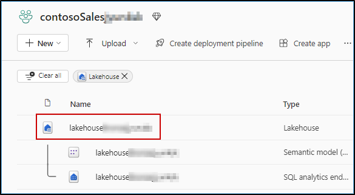

### Exercise 3: Power BI Experience
 
### Task 3.1: Create Semantic model and generate insights using Copilot for Power BI  in Microsoft Fabric

With the wide spectrum data sources as well as Litware's data in OneLake, it is now time to get some awesome insights and visualizations from this data. So, let's dive deep into the experience of the Business Analyst, Wendy, for just that. Based on all the gathered data, Wendy is expected to create Power BI reports for other data citizens and stakeholders. Let's step into her shoes to experience the power of Copilot for Power BI in conjunction with Direct Lake Mode.

1. Navigate back to the Microsoft Fabric tab on your browser.

2. Click on Workspaces and select contosoSales…


3. Click on **Filter** and select **Lakehouse**.

   	

4. Click on the **lakehouse...**.

>**Note:** There are 3 options for lakehouse, namely Lakehouse, Dataset (default) and SQL endpoint. Make sure you select the type **Lakehouse** option.

   

5. Click on the **New semantic model**.

Note: *wait for new semantic model page to popup.*

   

6. Enter **website_bounce_rate_model** in the Name field.
   
7. Select **contosoSales...** workspace.

8. select **website_bounce_rate** table and click on the **Confirm** button.

```BASH
website_bounce_rate_model
```


> Wait for the semantic model creation.

9. To create a new report using this semantic model, click on the **New Report** at the top bar.
 
   

Note: Close any pop-up which apears on the screen.

 

8. Click on the **Get started** button. You will now see how easy it is for the data analyst to create compelling Power BI reports and get deep insights with literally no hands-on coding!

   
	
9. Click on the **Prompt Guide** button.  

10. Select the option **What's in my data?**.
   
      

The first option, 'What’s in my data?' provides an overview of the contents of the dataset, identifies and describes what’s in it and what the attributes are about. So, there’s no need to wait for someone to explain the dataset. This improves the efficiency and volume of report creation.

11. Click in the Copilot chat box field and enter the prompt below
 
```BASH
Create a report Bounce Rate analysis, to show the correlation between customer sentiment, particularly among millennials and Gen Z, unsuccessful product searches across different devices, and the website's bounce rate by customer generations.  
```
Note: *Wait for the prompt to populate.*

12. Click on the **Send** button and wait for the results to load. 

      
	
>**Note:** If you see the error message saying, 'Something went wrong.', try refreshing the page and restart the task. Being in a shared environment, the service may be busy at times.
- If Copilot needs additional context to understand your query, consider rephrasing the prompt to include more details

>**Note:** The responses from Copilot may not match the ones in the screenshot but will provide a similar response.

Based on this report, we notice that the website bounce rate for Contoso is especially high amongst the Millennial customer segment. Let’s ask Copilot if it has any recommendations for improving this bounce rate based on the results and data in the report.

We’ll ask Copilot for suggestions based on the results and data in the report.

13. Enter the below prompt in Copilot, and press **Send** button.

```BASH
Based on the data in the page, what can be done to improve the bounce rate of millennials?
```

	
14. Look at the suggestions Copilot provided. Copilot creates the desired Power BI report and even goes a step further to give powerful insights. Wendy realizes that for the website bounce rate to improve, Contoso needs to transform their mobile website experience for millennials. This helps them reduce their millennial related customer churn too! Now, what if Contoso’s leadership team needed a quick summary of this entire report? Smart Narrative to the rescue!
	
      
	
15. Expand the **Visualizations** pane and select the **Narratives** visual. 


16. Click on **Copilot (preview)** within the visual.

      
	
17. Select **Give an executive summary**. 

18. Click on **Update** and observe the generated summary. See how easy it was to get an executive summary? And all this with absolutely no IT resource dependency!
 
      

19. Expand the narrative from the corner to get a better readable view of the result.
    


20. Click on the **close** button in the pop-up window.


     
The summary could also be generated in another language if specified. Additionally, the summary updates if you filter the report on any visual. How cool is that?

---
