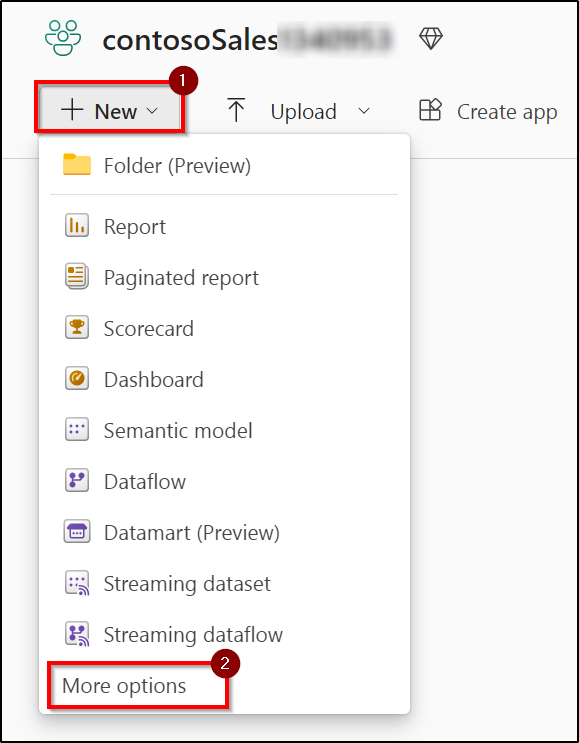
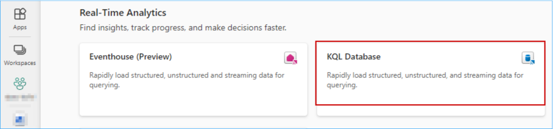
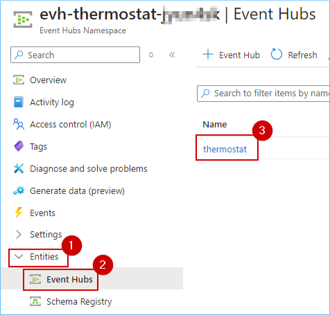
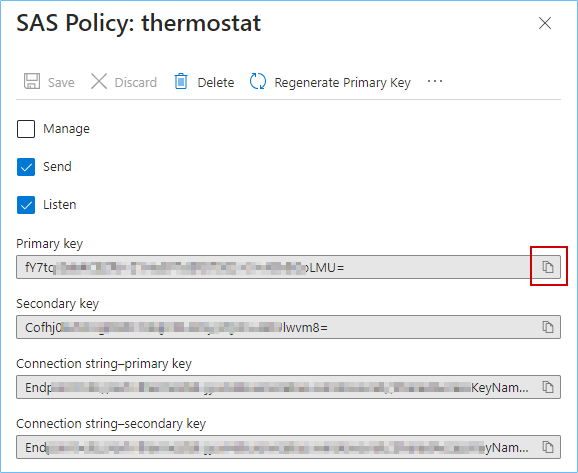
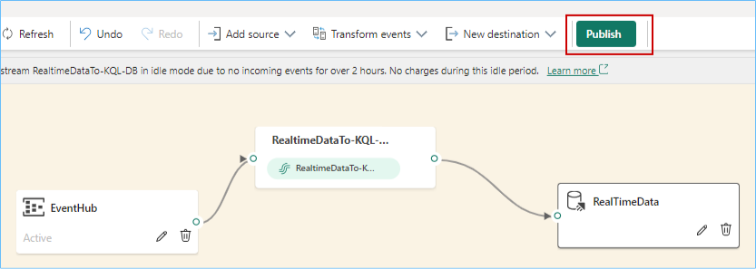

### Exercise 4: Real-time Analytics experience, explore Streaming data using Copilot for KQL DB

Imagine it is 6 am on the day of Contoso's big Thanksgiving sale. Customers are flocking to their stores in large numbers. We are about to witness the very culmination of Contoso's phonomenal transformation with Microsoft Fabric and ADB. Specifically, we will see how near real-time data is used to make decisions for the next moment in Contoso's stores to ensure optimal temperatures are maintained for their customers while they shop at the big sale! Let's see how! 

### Task 4.1: Ingest real-time/historical data into KQL DB using Eventstream

1. While you are in the Fabric workspace homepage, click on **+ New** and then click on **More options**.

	

2. In the new window, scroll down to the **Real-Time Analytics** section and click on **KQL Database**.

	

3. Enter the name **Contoso-KQL-DB**, click on the **Create** button and wait for the database to be created.

	

4. Click on the **contosoSales** workspace from left navigation pane.

   

5. Click on the **+ New** button.

   

6. Select **Eventstream**.

   

7. Enter the name as **RealtimeDataTo-KQL-DB** and click on **Create** button.

   

8. Click on the **Add Source** button.

   

9. Click on the **Azure Event Hub** button.

   

10. To fill in the fields below we need to navigate to Azure Portal.

   

11. Navigate to the **Azure Portal**. In the **rg-fabric...** resource group, search for the **event hubs namespace** and click on the **Event Hubs Namespace** resource.

   

12. Copy the name of the **Event Hub namespace** and paste it in a notepad for further use.

   

13. In the left navigation pane expand the **Entities** section, click on **Event Hubs**, and then click on the **thermostat** event hub.

   

14. In the left pane expand **Settings**, click on **Shared access policies** and then click on **thermostat**.

   

15. Copy the **Primary key** and paste it in a notepad for further use. 

   

16. Go back to the **Fabric tab** on your browser.

17. Make sure you are in the **Create new connection** section, paste the value for **Event Hub namespace** from **step 9** and enter the **Event Hub** value as **thermostat**.

   

18. Scroll down and select **Shared Access Key** for Authentication kind, enter **thermostat** as the Shared Access Key Name and then paste the value copied in **step 12** in the **Shared Access Key**.

19. Select Data format as **JSON** and then click on the **Connect** button.

   

>**Note:** Wait for the connection to be established.

20. Click on the **Next** button.

   

21. Click on the **Add** button.

   

22. In the Eventstream canvas, click on the **New destination** dropdown and select **KQL Database**.

   

23. Select the **Event processing before ingestion** radio button, enter **RealTimeData** as the Destination name.

24. Select **contosoSales...** and **Contoso-KQL-DB** from the respective 'Workspace' and 'KQL Database' dropdowns.

25. Finally click on the **Create new** button.

   

26. Enter the table name as **thermostat** and then click on the **Done** button.

   

27. Enter the Input data format as **Json**.

   

28. Click on the **Publish** button.

   

Real-time data from the event hub has been ingested successfully into the KQL Database.

---

### Task 4.2: Analyze/discover patterns, identify anomalies and outliers using Copilot

Kusto Query Language is a powerful tool. In this scenario KQL is used to explore Contoso’s data, discover patterns, identify anomalies and outliers, create statistical modeling, and more.

We use KQL to query the thermostat data that’s streaming in near real-time from the devices installed in Contoso’s stores.

1. Click on the **Workspaces** and select **contosoSales...** workspace from left navigation pane.


2. Click on the **+ New** button.
		


3. Select **KQL Queryset**.


4. Enter **Query Thermostat Data in Near Real-time using KQL Script** as the name and click on the **Create** button.


5. **Wait** for the query set creation and a new screen will display. In this screen, click on **Contoso-KQL-DB**, verify the workspace name and then click on the **Select** button.


6. Select all using **Ctrl + A** and **delete** the pre-written query.


7. Click on the **Copilot** button.


6. **Paste** the query provided below in the query section.

```
What is the average temperature every 1 min?
```

7. Click on the **send** icon.

8. Click on the **Insert** button.


9. Select the **script**, click on the **Run** button and you get the desired result.


*Similarly you can use the below prompts*

```
Are there any anomalies for this device?
```

---
