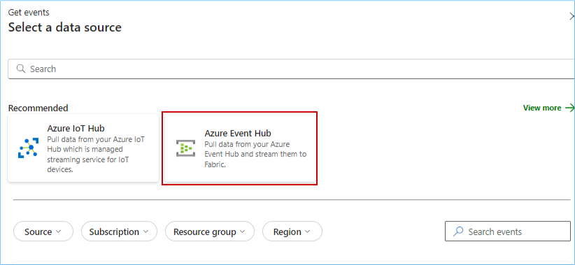
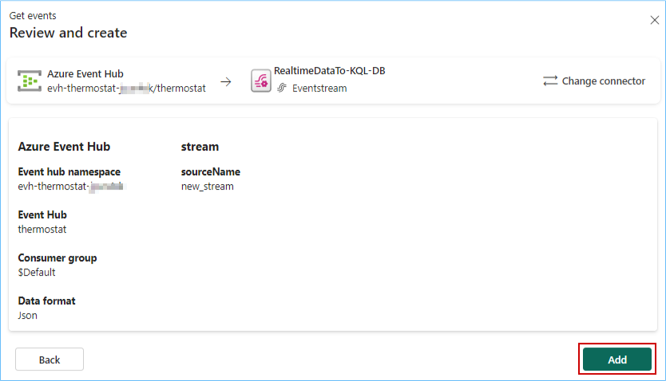
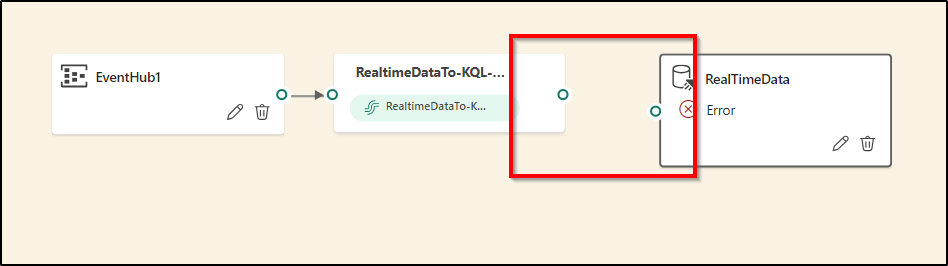
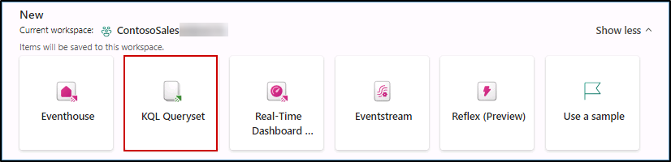

## **OPTIONAL EXERCISE**


### Exercise 4: Real-Time Intelligence experience, explore Streaming data using Copilot for KQL DB

Imagine it is 6 am on the day of Contoso's big Thanksgiving sale. Customers are flocking to their stores in large numbers. We are about to witness the very culmination of Contoso's phenomenal transformation with Microsoft Fabric and ADB. Specifically, we will see how near real-time data is used to make decisions for the next moment in Contoso's stores to ensure optimal temperatures are maintained for their customers while they shop at the big sale!

### Task 4.1: Ingest real-time/historical data into KQL DB using Eventstream

1. Click on **Workspaces** and select the **contosoSales...** workspace.


Note: *If you see any pop up click on* **Don't Save.**


1. While you are in the Fabric workspace homepage, click on the **experience** button on the **bottom left** of the screen and then select **Real-Time Intelligence**.

	

2. On Real-Time Intelligence experience screen, click on **Eventhouse.**

Note: *Wait for the new Eventhouse to popup.*


4. Enter the name **Contoso-Eventhouse**, click on the **Create** button and wait for the database to be created.

```BASH
Contoso-Eventhouse
```


**Note:** If you see a pop-up like the one in the screenshot below, ignore it and proceed with the next step.


6. Click on **Real-Time Intelligence** at the bottom left corner of the screen and select **Real-Time Intelligence**.

   

7. Scroll down and search for **Eventstream** under **Real-Time Intelligence.**

   

9. Enter the name as **RealtimeDataTo-KQL-DB** and and tick a checkbox 'Enhanced Capabilities(preview)' click on **Create** button.

```BASH
RealtimeDataTo-KQL-DB
```

   

10. Click on the **Add External Source** button.

   

11. Click on the **Azure Event Hub** button.

   

12. Under Connection Click on **New connection**.


12. To fill in the fields below we need to navigate to Azure Portal.

   

13. Navigate to the **Azure Portal**. In the **rg-fabric...** resource group, search for the **event hubs namespace** and click on the **Event Hubs Namespace** resource.

   

14. In the left navigation pane expand the **Entities** section, click on **Event Hubs**, and then click on the **thermostat** event hub.

   

15. In the left pane expand **Settings**, click on **Shared access policies** and then click on **thermostat**.

   

16. Copy the **Primary key** and paste it in a notepad for further use. 

   

17. Go back to the **Fabric tab** on your browser.

19. Make sure you are in the **Create new connection** section, paste the below value for **Event Hub namespace** and enter the **Event Hub** value as **thermostat**.

```BASH
<inject key= "eventhubNamespace" enableCopy="true"/>
```
```BASH
thermostat
```
   

20. Scroll down and select **Shared Access Key** for Authentication kind, enter **thermostat** as the Shared Access Key Name and then paste the value copied in **step 16** in the **Shared Access Key**.

```BASH
thermostat
```


21. Select Data format as **JSON** and then click on the **Next** button.

   

>**Note:** Wait for the connection to be established.

22. Click on the **Next** button.

   

23. Click on the **Add** button.

   

24. In the Eventstream canvas, click on the **New destination** dropdown and select **KQL Database**.

   

25. Select the **Event processing before ingestion** radio button, enter **RealTimeData** as the Destination name.

```BASH
RealTimeData
```

26. Select **contosoSales...** and **Contoso-Eventhouse** from the respective 'Workspace' and 'KQL Database' dropdowns.

27. Finally click on the **Create new** button.

   

28. Enter the table name as **thermostat** and then click on the **Done** button.

```BASH
thermostat
```
   

29. Enter the Input data format as **Json**.

Note: *Zoom-out on your screen if the Input data format field is not visible.*

   

30. Drag Arrow from 'RealtimeDataTo-KQL' and connect it to 'RealTimeData'.



Note: *Wait for the data ingestion from EventHub to KQL DB.*

31. Now, click on the **Publish** button.
    
   

Note: *Wait for the data ingestion from EventHub to KQL DB.*

32. Once you see that the streaming has started, click on Refresh and wait for the data to preview.

    

Real-time data from the event hub has been ingested successfully into the KQL Database. Next, as customers walk in aisles and the temperatures fluctuate, let us see how KQL queries proactively identify anomalies and help maintain an optimal shopping experience!

---

### Task 4.2: Analyze/discover patterns, identify anomalies and outliers using Copilot

Kusto Query Language is a powerful tool. In this scenario KQL is used to explore Contoso’s data, discover patterns, identify anomalies and outliers, create statistical modeling, and more.

We use KQL to query the thermostat data that’s streaming in near real-time from the devices installed in Contoso’s stores.

1. Click on the **Workspaces** and select **contosoSales...** workspace from left navigation pane.


2. Click on the **Real-Time Intelligence** at the bottom left corner of the screen and select **Real-Time Intelligence**.
		


3. Select **KQL Queryset**.



4. Enter **Query Thermostat Data in Near Real-time using KQL Script** as the name and click on the **Create** button.

```BASH
Query Thermostat Data in Near Real-time using KQL Script
```


5. **Wait** for the query set creation and a new screen will display. In this screen, click on **Contoso-Eventhouse**, verify the workspace name and then click on the **Connect** button.


6. Place your cursor inside the query field, select all using Ctrl + A and delete the pre-written query


7. Click on the **Copilot** button.


6. **Paste** the query provided below in the query section.

```BASH
Create a query to find average temperature every 1 min
```

7. Click on the **send** icon.

8. Click on the **Insert** button.


9. Select the **script**, click on the **Run** button and you get the desired result.


So, imagine if one of the aisles had a sudden rise in temperature. Customers start leaving that aisle and the wait times in the checkout lines start to increase. But thanks to the KQL Queries, those anomalies would be tracked and immediate notifications would be generated to bring the aisle temperature back to optimal levels! Now, after all these amazing data transformations in OneLake in a healthy ecosystem with Azure Databricks, can we actually predict customer churn for the future? Absolutely! In fact, in the next exercise, let’s see the power of Microsoft Fabric and Azure Databricks to do just that!

---
