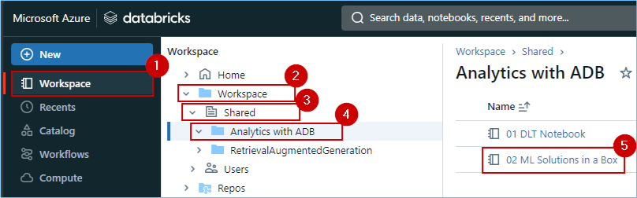
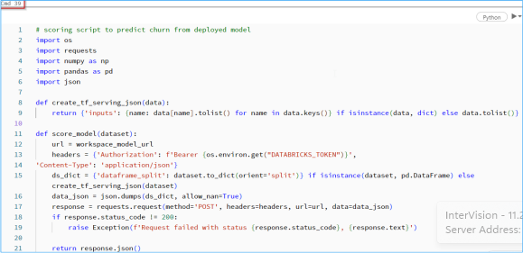

### Exercise 5: Data Science experience, explore Machine Learning and Business Intelligence scenarios in ADB (read only)
 
So, we saw how Contoso combined historical gold layer data from ADLS Gen2 with all OneLake data via shortcuts. Additionally, we saw how all that data could be easily accessed in Azure Databricks (thanks to the standard delta parquet format). Delta live tables were created in Azure Databricks for further curation of data. Contoso can now leverage the power of machine learning models in ADB on that data to gain meaningful insights and predict customer churn. Let's explore the Data Science Experience in Azure Databricks as Data Scientists!

### Task 5.1: Build ML models, experiments, and log ML model in the built-in model registry using MLflow and batch scoring

The architecture diagram shown here illustrates the end-to-end MLOps pipeline using the Azure Databricks managed MLflow.

After multiple iterations with various hyperparameters, the best performing model is registered in the Databricks MLflow model registry. Then it is set up as the model serving in the Azure Databricks Workspace for low latency requests.
	

1. Navigate back to the **Databricks workspace** we started for the previous exercise.

2. In the left navigation pane, select **Workspace** and click **Workspace** again. Select **Shared**, click on **Analytics with ADB** and finally click on the **03 ML Solutions in a Box.ipynb** notebook.

Now that we've ingested and processed our customer data, we want to understand what makes one customer more likely to churn than another, so we want to see if we can produce a machine learning model that can accurately predict if a particular customer will churn.

Ultimately, we would like to understand our customers' sentiment so we can create targeted campaigns to improve our sales.

3. Navigate to **cmd 10**.

With the data prepared, we can begin exploring the patterns it contains. 

Let's start by examining the customer churn outcome based on factors like a customer's tenure in months and their total amount spent at Contoso. As a result, we can see a high churn rate is seen if the customer's tenure is low, and they have a lower spend amount.

4. Navigate to **cmd 20**.

5. Navigate to **cmd 21**. 

By registering this model in Model Registry, we can easily reference the model from anywhere within Databricks.    

6. Review the **cmd 29** cell.

Let’s look at the comparison of multiple runs in the UI.

You can visualize the different runs using a parallel coordinates plot, which shows the impact of different parameter values on a metric.

The best ML model for Customer Churn is selected and registered with Databricks model registry.

7. Navigate to **cmd 38**.

For low-latency use cases, you can use MLflow to deploy the model for online serving. The serving system loads the Production model version from the Model Registry. 

8. Navigate to **cmd 40**.

It is then used to predict the probability of Customer Churn using the deployed model and this model endpoint is ready for production.

9. Navigate to **cmd 41**. 

Once we have the predicted data, it is stored back in delta tables in the gold layer back in OneLake.

	

---

Congratulations! You as Data Engineers have helped Contoso gain actionable insights from its disparate data sources, thereby contributing to future growth, customer satisfaction, and a competitive advantage.

In this lab we experienced the creation of a simple integrated, open and governed Data Lakehouse foundation using Modern Analytics with Microsoft Fabric and Azure Databricks.

In this lab we covered the following:

First, we explored the Data Engineering experience and learned how to create a Microsoft Fabric enabled workspace, build a Lakehouse, and ingest data into OneLake along with other data engineering operations with dataflow copilot.

Second, we explored an analytics pipeline using open Delta format and Azure Databricks Delta Live Tables to build a simple Lakehouse and integrate with OneLake with shortcuts.

Third, we explored data governance and generative AI features in Azure Databricks with Unity Catalog. We also explored ML and BI scenarios on the Lakehouse. Here we reviewed MLOps pipeline using the Azure Databricks managed MLflow with Azure ML.

Fourth, we the Power BI experience in Fabric with copilot and direct lake mode.

Fifth, we explored Streaming data using KQL DB for a Real-time Analytics experience. Here, we created a KQL Database, ingested real-time and historical data into KQL DB, analyzed patterns to uncover anomalies and outliers with the help of copilot.

Finally, we leveraged Power BI to derive actionable insights from data in the Lakehouse using Direct Lake mode.

