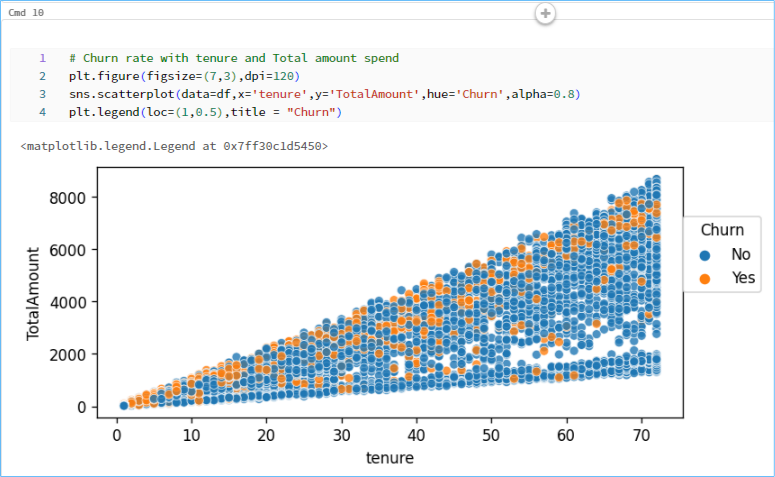
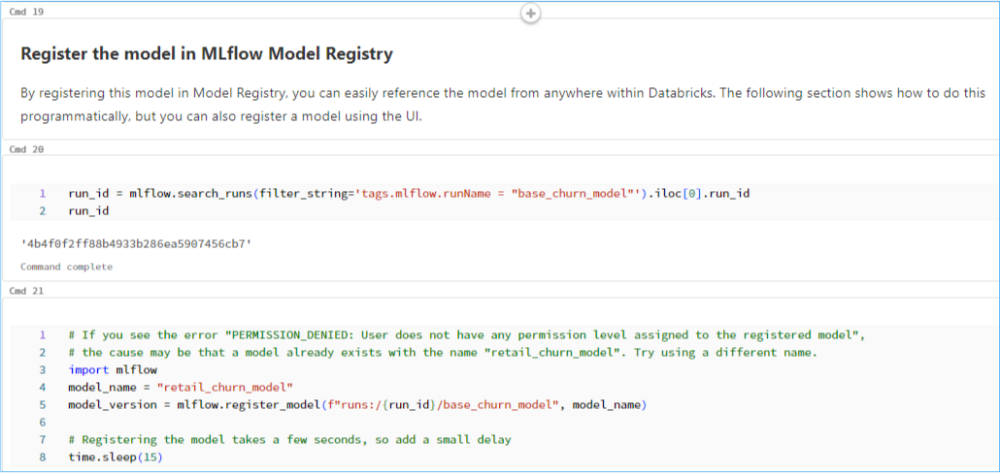
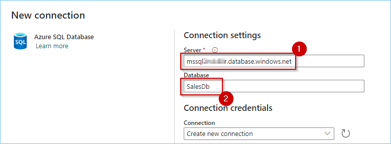
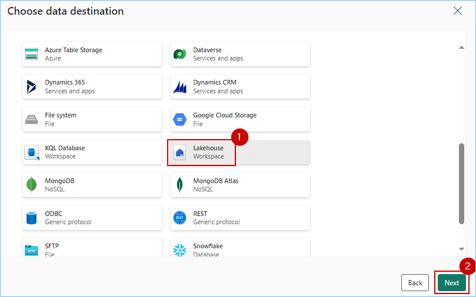
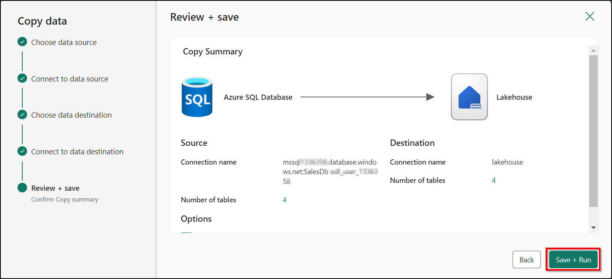

## **OPTIONAL EXERCISE**


### Exercise 5: Data Science experience, explore Machine Learning and Business Intelligence scenarios in ADB (read only)
 
We saw how Contoso combined historical gold layer data from ADLS Gen2 with all the OneLake data via shortcuts. Additionally, we saw how all that data could be easily accessed in Azure Databricks (thanks to the standard delta parquet format). Delta live tables were created in Azure Databricks for further curation of data. Contoso can now leverage the power of machine learning models in ADB on that data to gain meaningful insights and predict customer churn. Let's explore the Data Science Experience in Azure Databricks as Data Scientists!

### Task 5.1: Build ML models, experiments, and log ML model in the built-in model registry using MLflow and batch scoring

The architecture diagram shown here illustrates the end-to-end MLOps pipeline using the Azure Databricks managed MLflow.

After multiple iterations with various hyperparameters, the best performing model is registered in the Databricks MLflow model registry. Then it is set up as the model serving in the Azure Databricks Workspace for low latency requests.
	


1. Navigate back to the **Databricks workspace** we started for the previous exercise.

2. In the left navigation pane, select **Workspace** and click **Workspace** again. Select **Shared**, click on **Analytics with ADB** and finally click on the **02 ML Solutions in a Box.ipynb** notebook.


Now that we've ingested and processed our customer data, we want to understand what makes one customer more likely to churn than another, so we want to see if we can produce a machine learning model that can accurately predict if a particular customer will churn.

Ultimately, we would like to understand our customers' sentiment so we can create targeted campaigns to improve our sales.

3. Navigate to **cmd 9**.

Note: *Command numbers are written at the top of each cell.*

With the data prepared, we can begin exploring the patterns it contains.

Let's start by examining the customer churn outcome based on factors like a customer's tenure in months and their total amount spent at Contoso. As a result, we can see a high churn rate is seen if the customer's tenure is low, and they have a lower spend amount.



4. Navigate to **cmd 19**.

5. Navigate to **cmd 20**. 



By registering this model in Model Registry, we can easily reference the model from anywhere within Databricks.    

6. Review the **cmd 28** cell.

Let’s look at the comparison of multiple runs in the UI.

You can visualize the different runs using a parallel coordinates plot, which shows the impact of different parameter values on a metric.

The best ML model for Customer Churn is selected and registered with Databricks model registry.


7. Navigate to **cmd 37**.

For low-latency use cases, you can use MLflow to deploy the model for online serving. The serving system loads the Production model version from the Model Registry. 


8. Navigate to **cmd 39**.

It is then used to predict the probability of Customer Churn using the deployed model and this model endpoint is ready for production.


9. Navigate to **cmd 40**. 

Once we have the predicted data, it is stored back in delta tables in the gold layer back in OneLake.

	

---

## Task 1.1: Use the Data Pipelines/Data Flow for a ‘No Code, Low Code experience’ (Optional)

## Creating a Data Pipeline

1. Navigate back to Microsoft Fabric tab on your browser.

2. Click on Workspaces in the left navigation pane and select contosoSales..

   

3. Click on **Filter** and select **Data pipeline**.

 

4. Click on **Azure SQL DB Pipeline.**


   
17. In the Data pipeline window, click on **Copy data assistant**.

Note: *If the **copy data assistant** is not visible in the screen, please scroll up.*


18. In the pop-up, click on **+New** tab and scroll down through the resources, click on **Azure SQL Database**.

>**Note** You may not see the **Azure SQL Database** in the same location as shown in the screenshot.


19. Select the **Create new connection** radio button.

>**Note:** To fill in the details for required fields, we need to fetch the data from the SQL Database resource deployed in the Azure Portal, due to the time constrain we have provided the details below.


20. In the **Server** field, paste the value from the below.
```BASH
 <inject key= "MssqlServer" enableCopy="true"/>
```

21. Enter **SalesDb** in the **Database** field.

```BASH
SalesDb
```


22. Scroll down and select **Basic** for Authentication kind, enter **labsqladmin** as the Username, **Smoothie@2024** as the Password and click on the **Next** button.

```BASH
labsqladmin
```
```BASH
Smoothie@2024
```


>**Note:** Close any pop-up that you see throughout the lab.
   


23. Click on the **checkbox** for **Select all** and then click on the **Next** button.

Note: *Wait for the source to be appeared.*


27. Scroll down and click on **Lakehouse**, then click on the **Next** button.



28. Click on the **Existing Lakehouse** radio button, click on the **dropdown**, select **lakehouse...** and then click on the **Next** button.


29. Select the **Load to new table** radio button, click on the **checkbox** beside **Source** and then click on **Next**.
Note: *Wait for the mapping data source to be appeared.*


31. Click on **Save + Run**.



31. Click on the **OK** button in the Pipeline run window.


>**Note:** Wait for the pipeline to execute.

32. Click on the bell icon at the top right of the screen to verify the **Running status** of the pipeline.


33. Congratulations! You have successfully transferred the Sales data from Azure SQL Database to Lakehouse for Contoso.

##

### Task 2.3 (OPTIONAL) Deploy LLM Chatbots With the Databricks data Intelligence Platform

Contoso also wanted to improve how efficiently they analyzed hundreds of documents and news articles about their big merger and their company policies. Why? To track and improve their Market Sentiment KPI. Azure Databricks provides just the solution with its Delta Lake architecture supporting unstructured data, like PDF documents, with Lang chain models leveraging the Databricks Foundation Model for creating custom chatbots. Let's see how this was done.

**Note**: This section is optional. Due to time constraints, the following steps will be completed via an online Click-by-Click for setting up the Unity Catalog. Please follow the green beacons and the instructions on the screen for this exercise..

```BASH
https://regale.cloud/Microsoft/viewer/3067/task-23-deploy-llm-chatbots-with-the-data-intelligence-platform/index.html#/0/0
```
1. Click on the Start Demo button.


##

Congratulations! You as Data Engineers have helped Contoso gain actionable insights from its disparate data sources, thereby contributing to future growth, customer satisfaction, and a competitive advantage.

In this lab we experienced the creation of a simple integrated, open and governed Data Lakehouse foundation using Modern Analytics with Microsoft Fabric and Azure Databricks.

In this lab we covered the following:

First, we explored the Data Engineering experience and learned how to create a Microsoft Fabric enabled workspace, build a Lakehouse, and ingest data into OneLake along with other data engineering operations with dataflow copilot.

Second, we explored an analytics pipeline using open Delta format and Azure Databricks Delta Live Tables to build a simple Lakehouse and integrate with OneLake with shortcuts.

Third, we explored data governance and generative AI features in Azure Databricks with Unity Catalog. We also explored ML and BI scenarios on the Lakehouse. Here we reviewed MLOps pipeline using the Azure Databricks managed MLflow with Azure ML.

Fourth, we saw the Power BI experience in Fabric with copilot and direct lake mode.

Fifth, we explored Streaming data using KQL DB for a Real-time Analytics experience. Here, we created a KQL Database, ingested real-time and historical data into KQL DB, analyzed patterns to uncover anomalies and outliers with the help of copilot.

Finally, we leveraged Power BI to derive actionable insights from data in the Lakehouse using Direct Lake mode.


