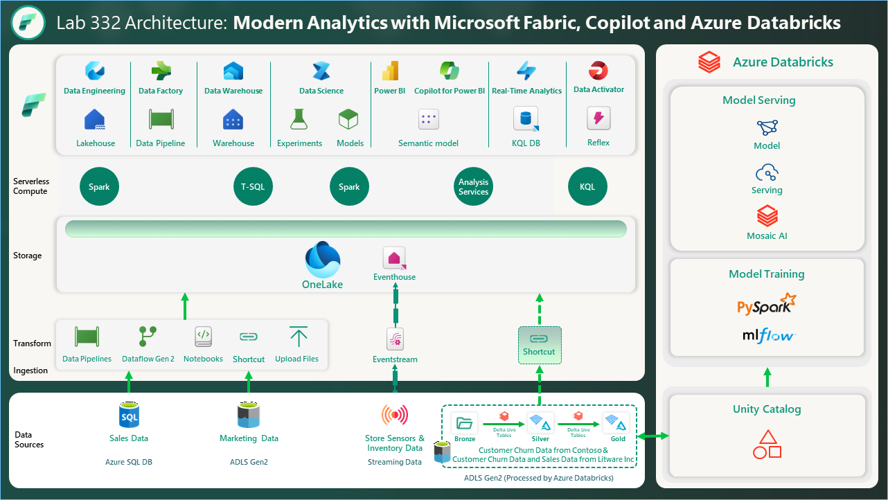

# **Modern Analytics with Microsoft Fabric,Copilot and Azure Databricks DREAM Lab (Lab332)**
**The estimated time to complete this lab is 45-60 minutes.**
 
## **Table of Contents**
 
## **Exercise 1: Data Engineering experience, Data ingestion from a spectrum of analytical data sources into OneLake**
 
 - Task 1.1: Use the Data Pipelines/Data Flow ‘No Code-Low Code experience’

 - Task 1.2: Use the ‘New Shortcut’ option from external data sources

 - Task 1.3: Transform data using Dataflow Gen2 ‘No Code-Low Code experience’ Copilot
 

## **Exercise 2: DLT Pipelines, Unity Catalog (Data governance), Metastore experience, Retrieval Augmented Generation (RAG) and Machine Learning (ML)**
 
 - Task 2.1: Explore Delta Live Table pipeline (Data Transformation)
 
 - Task 2.2: Explore the data in the Azure Databricks environment with Unity Catalog (unified governance solution for data and AI)
	
 - Task 2.3 Deploy LLM Chatbots With the Data Intelligence Platform 

 
## **Exercise 3: Power BI Experience**
 
- Task 3.1: Create a Semantic model and generate insights using Copilot for Power BI

## **Exercise 4: Real-time Analytics experience - Explore Streaming data using Copilot for KQL DB (optional)**
 
- Task 4.1: Ingest real-time/historical data into KQL DB using Eventstream
 
- Task 4.2: Analyze/discover patterns, identify anomalies and outliers using Copilot

## **Exercise 5: Data Science experience - Explore Machine Learning and Business Intelligence scenarios in ADB (read only)**
 
- Task 5.1: Build ML models, experiments, and log ML model in the built-in model registry using MLflow and batch scoring

### OVERVIEW

---
 

This lab showcases Modern Analytics with Microsoft Fabric and Azure Databricks, featuring a cost-effective, performance-optimized, and cloud-native Analytics solution pattern. This architecture unifies our customers' data estate to accelerate data value creation. The visual illustrates the real-world example for Contoso, a fictitious company. Contoso is a retailer with thousands of brick-and-mortar stores across the world. They also have an online store. Contoso is acquiring Litware Inc. Litware Inc. has curated marketing data and sales data processed by Azure Databricks and stored in the gold layer in ADLS Gen 2. In the following exercises, you will see how the Contoso team leveraged the power of Microsoft Fabric to ingest data from disparate sources, combine data with their existing data from ADLS Gen2, and derive meaningful insights. You will witness how the team used a shortcut to reference the existing Litware Inc. data from ADLS Gen2. Finally, you will see the advantages of Unity Catalog and creating LLM Chatbots with the Data Intelligence Platform.

The lab scenario starts on January 30th. The company's new CEO, April, recently noticed negative trends in their KPIs, including:

- High customer churn

- Declining sales revenue

- High bounce rate on their website

- High operating expense

- Poor customer experience

April asks Rupesh, the Chief Data Officer how they could create a data driven organization and reverse these adverse KPI trends. Rupesh talks to his technical team, including Eva, the data engineer, Miguel, the data scientist and Wendy, the business analyst. Rupesh tasks them with designing and implementing a solution pattern to realize this dream of a data driven organization. Our story centers around Rupesh and his team. They recognize that the existence of data silos within Contoso's various departments presents a significant integration challenge.

During this lab you will execute some of these steps as a part of this team to reverse these adverse KPI trends.
